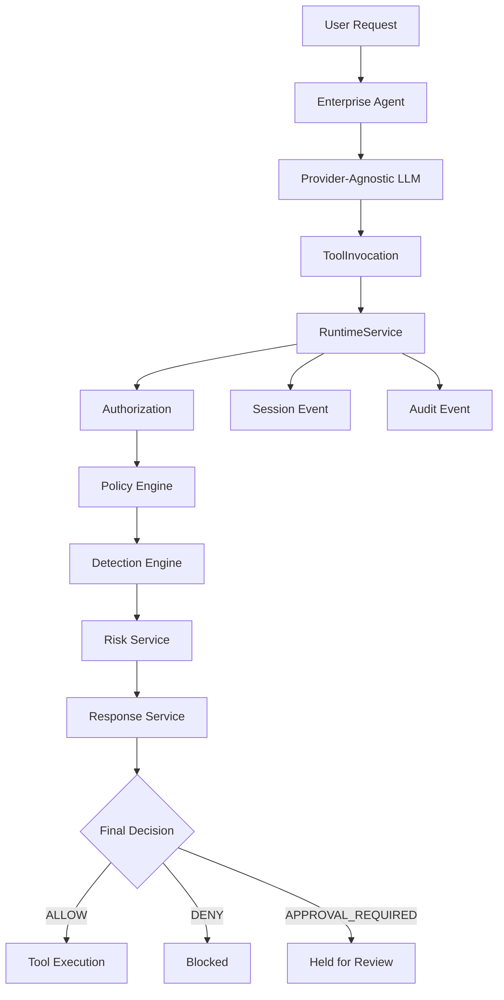

# Enterprise Agent Security Platform


A Zero Trust security platform for governing enterprise AI agents. Rather than building another AI agent framework, this project focuses on governing AI agents through deterministic security controls, runtime detection, risk-based response, and immutable audit logging.

> **The platform intentionally treats every LLM as an untrusted intent parser. All security decisions remain deterministic and are enforced outside the model.**

---

## Current Architecture



`RuntimeService` is the single authoritative source of security decisions. The LLM never makes authorization, policy, or security decisions.

---

## Why This Project?

Most AI agent frameworks focus on agent capabilities. This platform focuses on governing those agents.

The project demonstrates how organizations can apply Zero Trust principles to AI agents by separating natural language understanding from deterministic security enforcement. Every tool invocation passes through a complete security pipeline before execution is permitted.

---

## Project Metrics

| Metric | Current |
|----------|---------|
| Automated Tests | 186 |
| Detection Rules | 3 |
| Security Framework Mappings | 4 (OWASP LLM Top 10, MITRE ATLAS, MITRE ATT&CK) |
| Runtime Services | 8+ |
| Supported Tool Types | 2 |
| Python Version | 3.13+ |
| Architecture | Provider-Agnostic |
| Security Model | Zero Trust |

---

## Key Design Principles

- **Zero Trust Architecture** — Every request is verified, never implicitly trusted
- **Deterministic Security** — All security decisions are computed by deterministic code, never by LLMs
- **Provider-Agnostic** — LLM providers are interchangeable without affecting security controls
- **Least Privilege** — Agents are authorized only for explicitly approved tools and resources
- **Full Auditability** — Every runtime decision produces an immutable audit record
- **LLMs as Untrusted Intent Parsers** — The LLM converts natural language to structured `ToolInvocation` objects; nothing more

---

## Runtime Security Pipeline

Every tool invocation follows this deterministic pipeline inside `RuntimeService`:

```
1. Authorization     → Is the agent permitted to use this tool?
2. Policy Evaluation → Does the resource-aware policy allow this action?
3. Session Event     → Record the initial authorization decision
4. Detection         → Run all registered detection rules against the runtime context
5. Risk Assessment   → Score findings by severity and volume
6. Response          → Select a response action based on risk level
7. Decision Override → Apply Zero Trust enforcement (SUSPEND_AGENT → DENY, REQUIRE_APPROVAL → APPROVAL_REQUIRED)
8. Audit Event       → Record the final authoritative decision
9. Return            → AgentRuntimeService executes the tool only if decision is ALLOW
```

`AgentRuntimeService` is a thin orchestration layer responsible only for invoking the LLM, calling `RuntimeService`, and executing tools when permitted. It does not interpret or transform security decisions.

---

## Detection Framework

The platform implements a layered detection framework for identifying threats in AI agent runtime activity.

### Architecture

```
DetectionRule → RuleMetadata → DetectionRegistry → DetectionEngine → Risk → Response
```

### Detection Rules

Each detection rule implements the `DetectionRule` protocol and evaluates a `DetectionContext` containing:

- `user_prompt` — The raw user input
- `model_output` — The serialized LLM response
- `tool_output` — Output from prior tool executions
- `metadata` — Contextual attributes such as `tool_id` and `resource`

| Rule | Category | Description |
|------|----------|-------------|
| `PromptInjectionRule` | `PROMPT_SECURITY` | Detects deterministic prompt injection indicators in user prompts and model output |
| `SensitiveFileAccessRule` | `DATA_SECURITY` | Detects access to sensitive files (`.env`, `credentials`, `id_rsa`, etc.) |
| `DataExfiltrationRule` | `DATA_SECURITY` | Detects concurrent presence of exfiltration actions and sensitive data indicators |

### Detection Taxonomy

Detection categories classify types of detections rather than individual rules, keeping the taxonomy stable as rules are added:

- `PROMPT_SECURITY` — Prompt injection, jailbreaking
- `DATA_SECURITY` — Sensitive file access, data exfiltration
- `TOOL_SECURITY` — Tool abuse, unauthorized tool usage
- `IDENTITY_SECURITY` — Identity spoofing, impersonation
- `BEHAVIORAL_SECURITY` — Anomalous behavioral patterns
- `POLICY_SECURITY` — Policy violations

### Rule Metadata

Every detection rule exposes a frozen `RuleMetadata` dataclass containing:

- `name` — Stable rule identifier
- `category` — `DetectionCategory` classification
- `description` — Human-readable description
- `controls` — Tuple of `SecurityControlReference` mappings to industry frameworks

### Detection Registry

The `DetectionRegistry` provides centralized rule discovery and metadata lookup:

- `register(rule)` — Register a detection rule
- `get(rule_name)` — Retrieve a rule by name
- `rules()` — List all registered rules
- `categories()` — Return the set of active categories
- `metadata()` — Return metadata for all registered rules

---

## Security Standards Mapping

Detection rules are mapped to industry security frameworks through `SecurityControlReference`:

| Rule | Framework | Control ID | Title |
|------|-----------|------------|-------|
| `PromptInjectionRule` | OWASP LLM Top 10 | LLM01 | Prompt Injection |
| `PromptInjectionRule` | MITRE ATLAS | AML.T0043 | User Prompt Injection |
| `SensitiveFileAccessRule` | MITRE ATT&CK | T1083 | File and Directory Discovery |
| `DataExfiltrationRule` | MITRE ATT&CK | T1048 | Exfiltration Over Alternative Protocol |

Supported frameworks:

- **OWASP LLM Top 10** — AI-specific application security risks
- **MITRE ATLAS** — Adversarial Threat Landscape for AI Systems
- **MITRE ATT&CK** — Enterprise adversary techniques

---

## Implemented Features

### Core Runtime
- Enterprise Agent Runtime
- Provider-agnostic LLM integration (Ollama, Gemini)
- Runtime orchestration via `RuntimeService`
- Governed tool execution through Tool Registry

### Security Platform
- JWT authentication
- Role-Based Access Control (RBAC)
- Authorization Service
- Policy Engine with resource-aware authorization
- Runtime Service as single security authority
- Session management
- Audit Service with runtime integration

### Detection & Risk
- Detection Engine
- Prompt Injection Detection
- Sensitive File Access Detection
- Data Exfiltration Detection
- Detection Registry
- Rule Metadata
- Detection Taxonomy
- Security Standards Mapping (OWASP LLM, MITRE ATLAS, MITRE ATT&CK)
- Risk Service
- Response Service (MONITOR, ALERT, REQUIRE_APPROVAL, SUSPEND_AGENT)

### Registries
- Agent Registry
- Tool Registry
- Model Registry
- Detection Registry

### Tool Ecosystem
- `BaseTool` abstraction
- Rich Tool Metadata (identity, capabilities, governance, operational)
- Tool Discovery
- Tool Inventory Service
- File Read Tool
- Directory List Tool

---

## Current Project Status

### ✅ Backend (Completed)

- ✅ Runtime Security Pipeline
- ✅ JWT Authentication
- ✅ Role-Based Access Control
- ✅ Policy Engine
- ✅ Detection Engine
- ✅ Risk Assessment
- ✅ Response Engine
- ✅ Runtime Audit
- ✅ Detection Registry
- ✅ Security Standards Mapping (OWASP LLM, MITRE ATLAS, MITRE ATT&CK)
- ✅ Provider-Agnostic Model Layer (Ollama, Gemini)
- ✅ Tool Governance
- ✅ 186 Automated Tests

### 🚧 In Progress

- 🚧 REST API Expansion
- 🚧 Management APIs
- 🚧 Enterprise Security Console

### 📋 Planned

- 📋 Promptfoo Integration
- 📋 NVIDIA Garak
- 📋 Microsoft PyRIT
- 📋 PurpleLlama
- 📋 Giskard
- 📋 Multi-Agent Governance
- 📋 Model Governance
- 📋 Observability Dashboard

---

## Tech Stack

**Backend:** FastAPI, Pydantic

**AI & LLM:** Ollama (Llama 3.2), Google Gemini

**Security:** PyJWT

**Testing:** Pytest, Ruff

---

## Quick Start

### Ollama Setup

```bash
ollama pull llama3.2:3b
ollama serve
```

### Project Setup

```bash
git clone https://github.com/mathurshubh/enterprise-agent-security-platform.git

cd enterprise-agent-security-platform

python3 -m venv .venv

source .venv/bin/activate

pip install -r requirements.txt

python -m pytest
```

---

## Running the Demo

Start the Python REPL:

```bash
python
```

Then run:

```python
from app.services.agent_runtime_service import AgentRuntimeService

service = AgentRuntimeService()

print(service.execute("read notes.txt"))
print(service.execute("read secrets.txt"))
```

---

## Example

Query

```text
please read notes.txt
```

↓

Tool Selected

```text
file_read
```

↓

Policy Decision

```text
ALLOW
```

↓

Output

```text
notes.txt contents
```

---

Query

```text
please read secrets.txt
```

↓

Tool Selected

```text
file_read
```

↓

Policy Decision

```text
DENY
```

↓

Output

```text
None
```

---

## Testing

The platform maintains a comprehensive automated test suite validated with Ruff and Pytest:

- **186 automated tests** covering services, models, detection rules, policies, registries, scenarios, and tools
- **Ruff** linting with zero violations
- **Zero test warnings**

```bash
.venv/bin/ruff check
.venv/bin/python -m pytest
```

Test coverage spans:

- Runtime security pipeline
- Authorization and policy enforcement
- Detection rule evaluation
- Risk assessment and response selection
- Audit event recording
- Tool registry and execution
- Provider abstraction
- Attack scenario validation

---

## Documentation

The project documentation is organized as follows:

```text
docs/
├── ai/
│   ├── ARCHITECTURE_PRINCIPLES.md
│   ├── IMPLEMENTATION_WORKFLOW.md
│   ├── PROJECT_CONTEXT.md
│   ├── README.md
│   └── REVIEW_CHECKLIST.md
├── api/
│   └── openapi-design.md
├── architecture/
│   ├── system-architecture.md
│   └── data-model.md
├── evaluations/
│   └── tool-selection-evaluation-v1.md
├── releases/
│   └── v0.9.0.md
└── security/
    └── threat-model.md
```

### Key Documents

- **System Architecture:** `docs/architecture/system-architecture.md`
- **Data Model:** `docs/architecture/data-model.md`
- **Threat Model:** `docs/security/threat-model.md`
- **OpenAPI Design:** `docs/api/openapi-design.md`
- **LLM Evaluation:** `docs/evaluations/tool-selection-evaluation-v1.md`

---

## Repository Structure

```text
enterprise-agent-security-platform/
│
├── app/
│   ├── agents/          # Enterprise agent implementations
│   ├── api/             # FastAPI REST API
│   ├── auth/            # Authentication & authorization
│   ├── config/          # Configuration
│   ├── detection/       # Detection rules, engine, registry, taxonomy
│   ├── models/          # Domain models
│   ├── policy/          # Deterministic policy engine
│   ├── providers/       # LLM provider abstraction
│   ├── registry/        # Tool Registry and discovery
│   ├── scenarios/       # Attack scenarios
│   ├── services/        # Runtime orchestration services
│   └── tools/           # Governed tool implementations
│
├── demo_workspace/      # Demo workspace
├── docs/                # Architecture, security, and AI docs
├── scripts/             # Development utilities
├── tests/               # Unit and scenario tests (186 tests)
├── requirements.txt
├── pytest.ini
├── LICENSE
├── SECURITY.md
└── README.md
```

---

## Roadmap

### Completed

- Agent Registry and lifecycle management
- Tool Registry with rich metadata
- Model Registry
- JWT authentication and RBAC
- Policy Engine with resource-aware authorization
- Runtime Service as single security authority
- Prompt Injection Detection
- Sensitive File Access Detection
- Data Exfiltration Detection
- Detection Registry and taxonomy
- Rule Metadata and Security Standards Mapping
- Risk Service and Response Service
- Runtime Audit Integration
- Provider-agnostic LLM architecture (Ollama, Gemini)
- 186 automated tests with Ruff validation

### Upcoming

- REST API expansion
- Enterprise Security Console
- React Dashboard
- Human Approval Workflow
- Promptfoo Integration
- NVIDIA Garak Integration
- Microsoft PyRIT Integration
- Agent Observability (OpenTelemetry, Prometheus, Grafana)
- Multi-Agent Governance

---

## Project Goals

- Demonstrate production-style Zero Trust governance for enterprise AI agents
- Showcase deterministic security architecture and secure engineering patterns
- Build a production-quality AI security platform
- Provide a reference architecture for governed enterprise AI agents

---

## License

This project is licensed under the MIT License. See the [LICENSE](LICENSE) file for details.