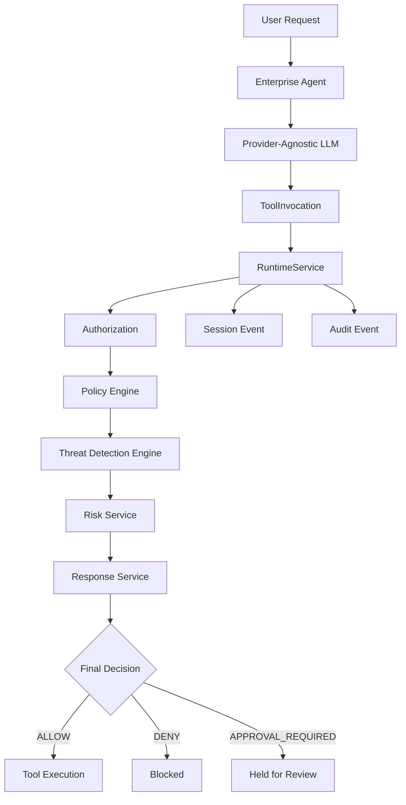

# Enterprise Agent Security Platform


**A production-quality reference implementation of Zero Trust security controls for enterprise AI agents.**

A Zero Trust security platform for governing autonomous AI agents in enterprise environments. Rather than building another AI agent framework, this platform provides runtime security orchestration, policy-driven authorization, real-time threat detection, and risk-based response controls.

> **The platform treats every LLM as an untrusted intent parser. All security decisions remain deterministic, auditable, and are enforced outside the AI model.**

---

## What This Platform Is

The Enterprise Agent Security Platform is a security and governance layer for enterprise AI agents.

It is **not** an AI agent framework.

Instead, it provides deterministic security controls around AI agents, including:

- Authentication
- Authorization
- Policy Enforcement
- Risk Assessment
- Detection
- Response
- Audit Logging
- Runtime Governance

---

## High-Level Architecture



`RuntimeService` is the single authoritative source of security decisions. The LLM never makes authorization, policy, or security decisions.

---

## Why This Project?

Most AI agent frameworks focus on agent capabilities. This platform focuses on governing those agents.

The project demonstrates how organizations can apply Zero Trust principles to AI agents by separating natural language understanding from deterministic security enforcement. Every tool invocation passes through a complete security pipeline before execution is permitted.

---

## Project Metrics

| Metric | Current |
|----------|---------|
| Automated Tests | 243 |
| Detection Rules | 3 |
| Security Framework Mappings | 4 (OWASP LLM Top 10, MITRE ATLAS, MITRE ATT&CK) |
| Runtime Services | 8+ |
| Supported Tool Types | 2 |
| Python Version | 3.13+ |
| Architecture | Provider-Agnostic |
| Security Model | Zero Trust |

---

## Core Design Principles

This platform is engineered around the following core security and software design principles:

*   **Zero Trust Architecture:** Every request is authenticated, authorized, evaluated, and audited; no internal transitions or agent actions are implicitly trusted.
*   **Deterministic Security Decisions:** All authorization, detection, and mitigation logic is implemented in deterministic code. The LLM never makes security decisions.
*   **Least Privilege Access:** Agents are restricted to explicitly approved tools and resources, guided by dynamic policies that evaluate agent and tool metadata.
*   **LLM as an Untrusted Intent Parser:** The AI model is treated as an untrusted client whose sole responsibility is converting natural language into structured request objects.
*   **Separation of AI Reasoning & Security Enforcement:** The execution engine (agent loop) is separated from the security pipeline (gatekeeper), ensuring clear boundaries and policy enforcement.
*   **Complete Auditability:** Every tool request, authorization decision, policy evaluation, and mitigation action is logged as an immutable event.
*   **Provider-Agnostic Design:** Core security services are decoupled from underlying LLMs, permitting seamless integration with alternative AI providers.

---

## Runtime Security Pipeline

Every tool invocation follows a deterministic security pipeline before execution is permitted:

```
1. Authorization     → Is the agent permitted to use this tool?
2. Policy Evaluation → Does the resource-aware policy allow this action?
3. Session Event     → Record the initial authorization decision
4. Detection         → Run all registered detection rules against the runtime context
5. Risk Assessment   → Score findings by severity and volume
6. Response          → Select a response action based on risk level
7. Decision Override → Apply Zero Trust enforcement (SUSPEND_AGENT → DENY, REQUIRE_APPROVAL → APPROVAL_REQUIRED)
8. Audit Event       → Record the final authoritative decision
9. Return            → Tool execution occurs only if the security decision is ALLOW
```

The runtime orchestration layer is responsible only for invoking the LLM and executing tools when permitted. It does not interpret or transform security decisions.

---

## Threat Detection Framework

The platform implements a layered detection framework for identifying threats in AI agent runtime activity.

### Layered Detection Rules

- **Prompt Injection Detection:** Analyzes incoming prompts and model responses for jailbreaks, adversarial payload instructions, and override attempts.
- **Sensitive File Access Detection:** Monitors resource targets to identify attempts to read configuration, credentials, or private keys (`.env`, SSH keys, etc.).
- **Data Exfiltration Detection:** Tracks the flow of sensitive data to alternative, unapproved outbound channels.

### Extensible Classification & Standards

- **Standardized Threat Taxonomy:** Detections are categorized into stable security areas (Prompt, Data, Tool, Identity, Behavioral, Policy) to support uniform reporting.
- **Security Standards Mapping:** Automatically links triggered detections to industry-standard threat catalogs (OWASP LLM Top 10, MITRE ATLAS, MITRE ATT&CK) for compliance and governance mapping.

---

## Security Standards Mapping

Detection rules are mapped to industry security frameworks to support governance, reporting, and compliance:

| Rule | Framework | Control ID | Title |
|------|-----------|------------|-------|
| `PromptInjectionRule` | OWASP LLM Top 10 | LLM01 | Prompt Injection |
| `PromptInjectionRule` | MITRE ATLAS | AML.T0043 | User Prompt Injection |
| `SensitiveFileAccessRule` | MITRE ATT&CK | T1083 | File and Directory Discovery |
| `DataExfiltrationRule` | MITRE ATT&CK | T1048 | Exfiltration Over Alternative Protocol |

Supported frameworks:

- **OWASP LLM Top 10** — AI-specific application security risks
- **MITRE ATLAS** — Adversarial Threat Landscape for AI Systems
- **MITRE ATT&CK** — Enterprise adversary techniques

---

## Implemented Features

### Core Runtime
- Enterprise Agent Runtime
- Provider-agnostic LLM integration (Ollama, Gemini)
- Runtime Security Pipeline
- Governed tool execution through Tool Registry
- Scenario Execution Engine (supports prompt & tool sequence validation)

### Security Platform
- JWT authentication
- Role-Based Access Control (RBAC)
- Agent authorization services
- Policy Engine with resource-aware authorization
- Deterministic runtime service as the single security authority
- Session management
- Audit logging service with runtime integration
- Security expectation assertion grading and diagnostic mismatch reporting
- Ephemeral runtime execution tracking and lifecycle logging

### Detection & Risk
- Threat Detection Engine
- Prompt Injection Detection
- Sensitive File Access Detection
- Data Exfiltration Detection
- Extensible Detection Framework
- Threat Classification and Taxonomy
- Security Standards Mapping (OWASP LLM, MITRE ATLAS, MITRE ATT&CK)
- Risk Assessment and Response Recommendation Service
- Response Enforcement Actions (MONITOR, ALERT, REQUIRE_APPROVAL, SUSPEND_AGENT)

### Registries
- Agent Registry
- Tool Registry
- Model Registry
- Threat Detection Registry
- Scenario Registry (pre-defined security validation scenarios)

### Tool Ecosystem
- Standardized tool integration model
- Tool metadata definition (identity, capabilities, governance, operational)
- Automated tool discovery
- Read-only tool inventory service
- File Read Tool
- Directory List Tool

---

## Current Project Status

### ✅ Backend (Completed)

- ✅ Runtime Security Pipeline
- ✅ JWT Authentication
- ✅ Role-Based Access Control
- ✅ Policy Engine
- ✅ Threat Detection Engine
- ✅ Risk Assessment
- ✅ Response Engine
- ✅ Runtime Audit
- ✅ Threat Detection Registry
- ✅ Scenario Registry and Framework
- ✅ Scenario Execution Engine (dual-mode execution paths)
- ✅ Security Standards Mapping (OWASP LLM, MITRE ATLAS, MITRE ATT&CK)
- ✅ Provider-Agnostic Model Layer (Ollama, Gemini)
- ✅ Tool Governance
- ✅ 243 Automated Tests

### 🚧 In Progress

- 🚧 REST API Expansion (including Scenario Execution endpoint)
- 🚧 Enterprise Security Console
- 🚧 Management APIs

### 📋 Planned

- 📋 Promptfoo Integration
- 📋 NVIDIA Garak
- 📋 Microsoft PyRIT
- 📋 PurpleLlama
- 📋 Giskard
- 📋 Multi-Agent Governance
- 📋 Model Governance
- 📋 Observability Dashboard

---

## Tech Stack

**Backend:** FastAPI, Pydantic

**AI & LLM:** Ollama (Llama 3.2), Google Gemini

**Security:** PyJWT

**Testing:** Pytest, Ruff

---

## Intended Audience

This project is designed for:

- **Security Engineers** looking to implement guardrails and validation tools around LLMs.
- **AI Platform Engineers** designing enterprise-grade agent orchestration systems.
- **Enterprise Architects** reviewing security boundary patterns for generative AI.
- **Security Researchers** exploring adversarial attacks, exfiltration vectors, and threat mapping.
- **Developers** building governed, policy-driven AI applications.

---

## Quick Start

### Ollama Setup

```bash
ollama pull llama3.2:3b
ollama serve
```

### Project Setup

```bash
git clone https://github.com/mathurshubh/enterprise-agent-security-platform.git

cd enterprise-agent-security-platform

python3 -m venv .venv

source .venv/bin/activate

pip install -r requirements.txt

python -m pytest
```

---

## Running the Demo

Start the Python REPL:

```bash
python
```

Then run:

```python
from app.services.agent_runtime_service import AgentRuntimeService

service = AgentRuntimeService()

print(service.execute("read notes.txt"))
print(service.execute("read secrets.txt"))
```

## Security Pipeline Examples

The examples below demonstrate how the Zero Trust pipeline processes agent requests.

### Example 1: Authorized Access

```text
[User Request]         → "Read the notes.txt file"
       ↓
[Tool Selection]       → Natural language parsed; 'file_read' tool is selected
       ↓
[Authorization Check]  → Agent authorization verified for 'file_read' tool
       ↓
[Policy Engine]        → Evaluates parameters (notes.txt is registered as non-sensitive) → ALLOW
       ↓
[Threat Detection]     → Scans context (No prompt injection, exfiltration, or traversal flags)
       ↓
[Risk Assessment]      → Risk Score: 0 (Risk Level: LOW)
       ↓
[Pipeline Response]    → Action: MONITOR (Log event)
       ↓
[Authoritative Result] → ALLOW (Tool executes; contents returned to agent)
```

### Example 2: Blocked Access

```text
[User Request]         → "Read the secrets.txt file"
       ↓
[Tool Selection]       → Natural language parsed; 'file_read' tool is selected
       ↓
[Authorization Check]  → Agent authorization verified for 'file_read' tool
       ↓
[Policy Engine]        → Evaluates parameters (secrets.txt is a sensitive resource) → DENY
       ↓
[Threat Detection]     → SensitiveFileAccessRule flags attempt to access protected resource
       ↓
[Risk Assessment]      → Risk Score: 25 (Risk Level: MEDIUM)
       ↓
[Pipeline Response]    → Action: ALERT (Overrides decision to DENY, flags audit record)
       ↓
[Authoritative Result] → DENY (Tool execution blocked; agent receives empty output)
```

---

## Testing

The platform maintains a comprehensive automated test suite validated with Ruff and Pytest:

- **243 automated tests** covering services, models, detection rules, policies, registries, scenarios, and tools
- **Ruff** linting with zero violations
- **Zero test warnings**

```bash
.venv/bin/ruff check
.venv/bin/python -m pytest
```

Test coverage spans:

- Runtime security pipeline
- Authorization and policy enforcement
- Detection rule evaluation
- Risk assessment and response selection
- Audit event recording
- Tool registry and execution
- Provider abstraction
- Attack scenario validation and dual-mode execution

---

## Documentation

The project documentation is organized as follows:

```text
docs/
├── adr/                 # Architecture Decision Records
│   └── Architecture Decision Records
├── ai/
│   ├── ARCHITECTURE_PRINCIPLES.md
│   ├── IMPLEMENTATION_WORKFLOW.md
│   ├── PROJECT_CONTEXT.md
│   ├── README.md
│   └── REVIEW_CHECKLIST.md
├── api/
│   └── openapi-design.md
├── architecture/
│   ├── system-architecture.md
│   └── data-model.md
├── evaluations/
│   └── tool-selection-evaluation-v1.md
├── releases/
│   └── Release Notes
└── security/
    └── threat-model.md
```

### Key Documents

- **System Architecture:** `docs/architecture/system-architecture.md`
- **Data Model:** `docs/architecture/data-model.md`
- **Threat Model:** `docs/security/threat-model.md`
- **OpenAPI Design:** `docs/api/openapi-design.md`
- **LLM Evaluation:** `docs/evaluations/tool-selection-evaluation-v1.md`
- **Architecture Decision Records:** `docs/adr/` directory (defining security boundaries, deterministic pipelines, and runtime lifecycles)

---

## Repository Structure

```text
enterprise-agent-security-platform/
│
├── app/
│   ├── agents/          # Enterprise agent execution loops
│   ├── api/             # FastAPI REST API endpoints
│   ├── auth/            # Agent authentication and authorization
│   ├── config/          # Platform configuration
│   ├── detection/       # Threat detection rules and engine
│   ├── models/          # Shared domain models
│   ├── policy/          # Resource-aware policy engine
│   ├── providers/       # LLM provider abstractions
│   ├── registry/        # Component registries (agent, tool, model)
│   ├── scenarios/       # Security validation scenarios
│   ├── services/        # Core security services
│   └── tools/           # Governed tool implementations
│
├── demo_workspace/      # Demo environment
├── docs/                # Architecture, security, and design records
├── scripts/             # Development utilities
├── tests/               # Unit and integration tests (243 tests)
├── requirements.txt
├── pytest.ini
├── LICENSE
├── SECURITY.md
└── README.md
```

---

## Roadmap

### Completed

- Agent Registry and lifecycle management
- Tool Registry with rich metadata
- Model Registry
- JWT authentication and RBAC
- Policy Engine with resource-aware authorization
- Runtime Security Pipeline
- Prompt Injection Detection
- Sensitive File Access Detection
- Data Exfiltration Detection
- Threat Detection Registry and taxonomy
- Security Standards Mapping
- Risk Service and Response Service
- Runtime Audit Integration
- Provider-agnostic LLM architecture (Ollama, Gemini)
- Scenario Registry and Framework
- Scenario Execution Engine
- 243 automated tests with Ruff validation

### Upcoming

- REST API expansion (including Scenario Execution Endpoint)
- Enterprise Security Console
- React Dashboard
- Human Approval Workflow
- Promptfoo Integration
- NVIDIA Garak Integration
- Microsoft PyRIT Integration
- Agent Observability (OpenTelemetry, Prometheus, Grafana)
- Multi-Agent Governance

---

## Project Goals

- Demonstrate Zero Trust governance for enterprise AI agents
- Provide a production-quality reference architecture
- Showcase deterministic AI security engineering
- Enable governed enterprise AI systems

---

## License

This project is licensed under the MIT License. See the [LICENSE](LICENSE) file for details.