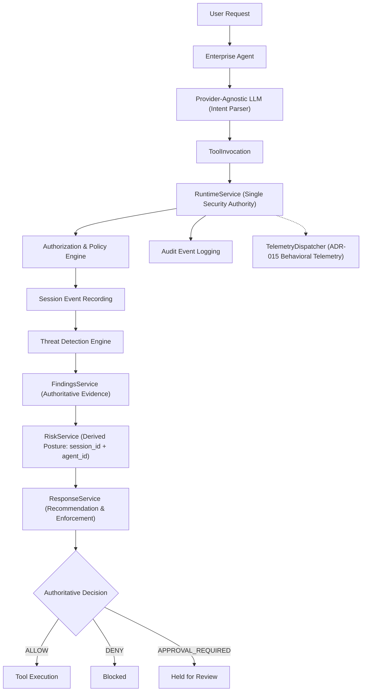

# Enterprise Agent Security Platform


**A production-quality reference implementation of Zero Trust security controls for enterprise AI agents.**

A Zero Trust security platform for governing autonomous AI agents in enterprise environments. Rather than building another AI agent framework, this platform provides runtime security orchestration, policy-driven authorization, real-time threat detection, dynamic risk assessment, and risk-based response controls.

> **The platform treats every LLM as an untrusted intent parser. All security decisions remain deterministic, auditable, and are enforced outside the AI model.**

---

## What This Platform Is

The Enterprise Agent Security Platform is a security and governance layer for enterprise AI agents.

It is **not** an AI agent framework or orchestration tool.

Instead, it provides deterministic security controls around AI agents, including:

- Authentication (FastAPI HTTPBearer JWT) and plane authorization (role-gated API surfaces, execution identity bound to the authenticated agent)
- Resource-Aware Authorization
- Policy Enforcement
- Threat Detection & Behavioral Intelligence
- Behavioral Telemetry Architecture (Non-Blocking Dispatcher & Canonical BehavioralEvent)
- Authoritative Security Findings Persistence
- Dynamic Risk Assessment & Risk Level Calculation
- Automated Response Actions
- Immutable Audit Logging
- Management API & Enterprise Findings Console

---

## High-Level Architecture


```mermaid
flowchart TD
    A["User Request"] --> B["Enterprise Agent"]
    B --> C["Provider-Agnostic LLM (Intent Parser)"]
    C --> D["ToolInvocation"]
    D --> E["RuntimeService (Single Security Authority)"]
    E --> F["Authorization & Policy Engine"]
    F --> G["Session Event Recording"]
    G --> H["Threat Detection Engine"]
    H --> I["FindingsService (Authoritative Evidence)"]
    J --> K["ResponseService (Recommendation & Enforcement)"]
    I --> J["RiskService (Derived Posture: session_id + agent_id)"]
    K --> L{"Authoritative Decision"}
    L -->|ALLOW| M["Tool Execution"]
    L -->|DENY| N["Blocked"]
    L -->|APPROVAL_REQUIRED| O["Held for Review"]
    E --> P["Audit Event Logging"]
    E -.-> Q["TelemetryDispatcher (ADR-015 Behavioral Telemetry)"]
```

`RuntimeService` is the single authoritative source of security decisions. The LLM never makes authorization, policy, detection, risk, or enforcement decisions.

### Canonical Architectural Security Chain

Every interaction is governed through a deterministic, end-to-end security chain:

```text
Identity → Authority → Policy → Capability → Runtime → Resource → Telemetry → Response
```

1. **Identity:** Authenticates agent and caller principals with cryptographic binding.
2. **Authority:** Determines whether the principal is permitted to execute or manage capabilities.
3. **Policy:** Evaluates fine-grained, resource-aware access rules over requested parameters.
4. **Capability:** Resolves approved operations against strictly governed capability registries.
5. **Runtime:** Enforces containment, execution grants, and one-way suspension boundaries.
6. **Resource:** Restricts operations against enterprise data, filesystems, and network endpoints.
7. **Telemetry:** Captures non-blocking behavioral events and tamper-resistant audit logs.
8. **Response:** Dynamically mitigates risk via automated monitoring, escalation, or suspension.

---

## Release & Platform Status

- **Latest Published GitHub Release:** `v0.15`
- **Latest Repository Tag:** `v0.15.0`
- **Current Development Cycle:** `v0.16.0` — Unreleased
- **Strategic Architecture Baseline:** Jan–Aug 2026 AI Security Architecture Baseline Review (`4abf2b6`)
- **Automated Test Coverage:** **851 passed, 7 xfailed backend pytest tests** (`.venv/bin/python -m pytest`)
- **Frontend Build Status:** Passing (`npm run build` & `npm run lint`)
- **Architecture Reference Range:** ADR-000 through ADR-028

---

## Project Metrics

| Metric | Value |
|----------|---------|
| Automated Tests | 851 Passing (7 xfailed) |
| Latest Published GitHub Release | v0.15 |
| Latest Repository Tag | v0.15.0 |
| Current Development Cycle | v0.16.0 (Unreleased) |
| Architecture Baseline Commit | 4abf2b6134d894d15bad76a0ec45db6adecb6262 |
| Detection Rules | 4 (`PROMPT_INJECTION`, `SENSITIVE_FILE_ACCESS`, `DATA_EXFILTRATION`, `EXCESSIVE_DENIALS`) |
| Security Framework Mappings | 3 (OWASP LLM Top 10, MITRE ATLAS, MITRE ATT&CK) |
| Core Services | 10+ (`AgentService`, `ToolService`, `SessionService`, `FindingsService`, `RiskService`, `ResponseService`, `AuditService`, `RuntimeService`, `CapabilityService`, `ScenarioRunnerService`) |
| Python Version | 3.13+ |
| Security Model | Zero Trust (Deterministic Security Pipeline) |

---

## Core Design Principles

This platform is engineered around the following core security and software design principles:

*   **Zero Trust Architecture:** Every request is authenticated, authorized, evaluated, and audited; no internal transitions or agent actions are implicitly trusted.
*   **Deterministic Security Decisions:** All authorization, detection, risk assessment, and mitigation logic is implemented in deterministic code. The LLM never makes security decisions.
*   **Least Privilege Access:** Agents are restricted to explicitly approved tools and resources, guided by dynamic policies that evaluate agent and tool metadata.
*   **LLM as an Untrusted Intent Parser:** The AI model is treated as an untrusted client whose sole responsibility is converting natural language into structured request objects (`ToolInvocation`).
*   **Authoritative Evidence vs Derived Posture:** `Finding` objects stored in `FindingsService` represent authoritative security evidence. `RiskAssessment` objects in `RiskService` represent derived process-local posture indexed by composite `(session_id, agent_id)` keys.
*   **Cumulative Risk Posture:** Dynamic risk calculation aggregates all authoritative findings recorded for a session and agent scope. Subsequent benign tool executions maintain the session's cumulative risk level.
*   **Complete Auditability:** Every tool request, authorization decision, policy evaluation, finding, risk score, and mitigation action is logged as an immutable event.
*   **Provider-Agnostic Design:** Core security services are decoupled from underlying LLMs, permitting integration with alternative AI providers (Ollama, Gemini).

---

## Runtime Security Pipeline

The `RuntimeService` executes a deterministic security pipeline for every incoming `ToolInvocation`:

```text
1. Authorization     → Is the agent permitted to use this tool?
2. Policy Evaluation → Does the resource-aware policy allow this action?
3. Session Event     → Record the initial decision state
4. Detection         → Run detection rules against prompt, model output, tool output, and session events
5. Findings          → Record security findings in FindingsService (authoritative evidence)
6. Risk Assessment   → Calculate cumulative risk score and risk level for (session_id, agent_id) scope
7. Response          → Select response recommendation based on risk level
8. Decision Override → Apply Zero Trust enforcement (SUSPEND_AGENT → DENY, REQUIRE_APPROVAL → APPROVAL_REQUIRED)
9. Audit Event       → Record the final authoritative decision in AuditService
10. Execution        → Governed tool execution occurs ONLY if the final decision is ALLOW
```

---

## Implemented Platform Capabilities

### Core Runtime & Provider Layer
- Enterprise Agent Runtime
- Provider-agnostic LLM abstraction (Ollama, Gemini)
- Deterministic `RuntimeService` as single security authority
- Governed tool execution through Tool Registry
- Scenario Execution Engine & Framework
- Runtime Capability Discovery (`CapabilityService`, `PlatformCapabilities`)

### Security & Governance
- JWT authentication
- Plane authorization: each API surface declares the roles it admits, and a route may narrow its plane but never widen it
- Agent authorization service
- Resource-aware Policy Engine
- Session management (`SessionService`)
- Immutable audit event logging (`AuditService`)

### Behavioral Intelligence, Findings & Dynamic Risk
- Threat Detection Engine & Registry
- Prompt Injection Detection (`PROMPT_INJECTION`)
- Sensitive File Access Detection (`SENSITIVE_FILE_ACCESS`)
- Data Exfiltration Detection (`DATA_EXFILTRATION`)
- Excessive Denials Detection (`EXCESSIVE_DENIALS`)
- Security Standards Mapping (OWASP LLM Top 10, MITRE ATLAS, MITRE ATT&CK)
- **Findings & Alerts API (`GET /api/v1/findings`, `FindingsService`)**
- **Dynamic Risk Assessment Engine (`RiskService`, `GET /api/v1/risk-assessments`)**
- **Risk Assessment Scope Isolation:** Derived posture indexed by composite `(session_id, agent_id)` keys with `400 Bad Request` ambiguity protection.
- Response Actions & Zero Trust Overrides (`MONITOR`, `ALERT`, `REQUIRE_APPROVAL`, `SUSPEND_AGENT`)

### Management API & Enterprise Security Console
- Read-only Management API endpoints (`/v1/agents`, `/v1/tools`, `/v1/sessions`, `/v1/audit/events`, `/v1/findings`, `/v1/risk-assessments`)
- Enterprise Security Console UI (`/agents`, `/tools`, `/sessions`, `/rules`, `/findings`)

---

## Security Standards Mapping

Detection rules are mapped to industry security frameworks:

| Rule | Framework | Control ID | Title |
|------|-----------|------------|-------|
| `PromptInjectionRule` | OWASP LLM Top 10 | LLM01 | Prompt Injection |
| `PromptInjectionRule` | MITRE ATLAS | AML.T0043 | User Prompt Injection |
| `SensitiveFileAccessRule` | MITRE ATT&CK | T1083 | File and Directory Discovery |
| `DataExfiltrationRule` | MITRE ATT&CK | T1048 | Exfiltration Over Alternative Protocol |

---

## Tech Stack

- **Backend:** Python 3.13+, FastAPI, Pydantic
- **Frontend:** React, TypeScript, TanStack Query, Vite, Tailwind CSS
- **AI & LLM Integration:** Ollama (Llama 3.2), Google Gemini
- **Security & Authentication:** PyJWT
- **Testing & Quality:** Pytest, ESLint, Vite Build

---

## Quick Start

### 1. Ollama Setup

```bash
ollama pull llama3.2:3b
ollama serve
```

### 2. Backend Setup & Verification

```bash
git clone https://github.com/mathurshubh/enterprise-agent-security-platform.git
cd enterprise-agent-security-platform

python3 -m venv .venv
source .venv/bin/activate
# requirements.txt is generated from requirements.in; see docs/development/local-development.md
pip install -r requirements.txt

# Required: the platform fails closed without an explicit signing key.
# There is no development fallback, and .env files are not loaded.
export JWT_SECRET_KEY="$(python3 -c 'import secrets; print(secrets.token_urlsafe(48))')"

.venv/bin/python -m pytest
```

### Start the development environment

One command starts the backend and the Enterprise Security Console together, generating
an ephemeral signing secret and a matching development token so no credentials are
created or copied by hand:

```bash
scripts/dev-start.sh
```

The console is served at `http://localhost:3000` and the backend at
`http://127.0.0.1:8000`. `Ctrl+C` stops both, and the development credentials cease to
exist. See [Local Development](docs/development/local-development.md) for options and the
manual alternative.

### 3. Frontend Setup

```bash
cd frontend
npm install
npm run build
npm run lint
```

---

## Testing

The platform maintains a comprehensive automated test suite executed with Pytest:

- **851 passing automated tests (7 xfailed)** covering authorization, policies, detection rules, findings service, risk service, runtime execution, management APIs, scenario validation, and materialized risk projections.
- **Ruff & ESLint** workflows enforce code quality.

```bash
.venv/bin/python -m pytest
```

---

## Documentation

- **DevSecOps & Quality Gates:** `docs/development/ci-cd-devsecops.md`
- **System Architecture:** `docs/architecture/system-architecture.md`
- **Data Model:** `docs/architecture/data-model.md`
- **Threat Model:** `docs/security/threat-model.md`
- **AI Security Architecture Review (Jan–Aug 2026):** `docs/security/ai-security-architecture-review-jan-aug-2026.md`
- **Architecture Validation Log:** `docs/research/architecture-validation.md`
- **OpenAPI Design:** `docs/api/openapi-design.md`
- **Architecture Decision Records:** `docs/adr/` (ADR-000 through ADR-028)
- **PR #87 Documentation Audit & Plan:** `docs/research/pr-87-documentation-audit.md` & `docs/research/pr-87-documentation-plan.md`

---

## AI Security Roadmap

The platform roadmap is grounded in the **Jan–Aug 2026 AI Security Architecture Baseline Review** ([`docs/security/ai-security-architecture-review-jan-aug-2026.md`](docs/security/ai-security-architecture-review-jan-aug-2026.md), commit `4abf2b6134d894d15bad76a0ec45db6adecb6262`).

The architecture follows a strict three-tier progression separating operational capabilities from upcoming architectural phases and long-term research:

```text
Current / Implemented (Tier 1)
        ↓
Next Architectural Phase (Tier 2)
        ↓
Future / Research (Tier 3)
```

### Tier 1: Current / Implemented
- **Policy Decision Point & Deterministic Authorization:** `RuntimeService`, `AuthorizationService`, `PolicyEngine` (ADR-004, ADR-006).
- **Tool Authorization & Registry Governance:** `ToolRegistry` controlling capability resolution and metadata access separation (ADR-005).
- **Resource-Aware Authorization:** Parameter-level resource path verification independent of model reasoning.
- **Threat Detection Engine:** Stateless content inspection (`PROMPT_INJECTION`, `SENSITIVE_FILE_ACCESS`, `DATA_EXFILTRATION`) and stateful behavioral tracking (`EXCESSIVE_DENIALS`) (ADR-017).
- **Authoritative Security Findings:** Thread-safe `FindingsService` recording immutable security evidence (ADR-016, ADR-028).
- **Dynamic Risk Engine & Materialized Posture:** Continuous risk calculation, composite `(session_id, agent_id)` isolation, and $\mathcal{O}(1)$ materialized risk projections (`RiskAggregator`, ADR-018, ADR-026).
- **Agent Enforcement State & Atomic Baselines:** One-way runtime suspension, baseline epoch isolation, and administrative reinstatement (ADR-024, ADR-026).
- **Execution Authorization Grants:** Single-use execution tokens matching requested operations (`DefaultToolExecutor`, ADR-023).
- **Management Plane Authorization:** Router-level plane authorization separating operator roles from agent execution (ADR-025).
- **Immutable Audit Logging & Behavioral Telemetry:** Non-blocking `TelemetryDispatcher`, canonical `BehavioralEvent`, and append-only audit trail (ADR-015, ADR-028).
- **Governed LLM Tool Selection:** Provider abstraction (Ollama, Gemini) parsing natural language into structured `ToolInvocation` objects without granting models decision authority.
- **Human Approval Escalation:** `ResponseService` mapping elevated risk to `REQUIRE_APPROVAL` (ADR-019, ADR-020).

### Tier 2: Next Architectural Phase
- **Agent Identity Model:** Explicit agent identity lifecycles and cryptographic workload credentials.
- **Delegated Authorization:** Formal representation of human-to-agent and service-account delegation chains (`Human → Delegation → Agent → Tool`).
- **Secure Execution & Runtime Enforcement:** Host-level process sandboxing, egress network filtering, and filesystem restrictions below the tool layer.
- **Tool / Skill / MCP Registry Security:** Verification of tool provenance, publisher identity, version integrity, and capability declarations for Model Context Protocol servers.
- **Agent Security Observability:** Distributed tracing across agent reasoning and tool boundaries (OpenTelemetry, Prometheus, Jaeger).
- **Enhanced Prompt & Indirect Injection Detection:** Context-aware detection for indirect injection in retrieved enterprise content.
- **Automated Adversarial Security Evaluation:** Continuous automated red-teaming pipelines (Promptfoo, Garak, PyRIT).

### Tier 3: Future / Research
- **Memory & Context Security:** Controlled validation, provenance tracking, and expiration boundaries for persistent agent memory.
- **Workflow Integrity Verification:** Multi-step tool sequence validation detecting aggregate harm from individually permitted actions.
- **Multi-Agent Governance (A2A):** Cross-agent delegation bounds, peer verification, and cascading compromise prevention.
- **AI Supply-Chain Attestation:** Cryptographic signing and vulnerability scanning for model weights, plugins, skills, and dependencies.
- **Runtime Attestation & Hardware Isolation:** MicroVM / confidential computing containment for hostile agent execution.
- **Autonomous Cyber-Operation Evaluation:** Defenses against autonomous vulnerability discovery and lateral exploitation.
- **Advanced Incident Response:** Automated forensic capture and distributed kill switches.
- **Provider Trust & Integrity Verification:** Dynamic evaluation of model adapter integrity and provider-side tampering.

### Newly Identified Threat Domains
The platform threat model incorporates 14 critical threat domains identified in the Jan–Aug 2026 review:
1. Indirect Prompt Injection
2. Tool Abuse
3. MCP Compromise & Tool Poisoning
4. Agent Identity & Impersonation
5. Delegated Authorization Abuse
6. Credential Theft
7. AI Supply-Chain Compromise
8. Runtime Escape & Containment Failure
9. Memory / Context Poisoning
10. Workflow Manipulation
11. Agent Persistence
12. Agent-to-Agent Abuse
13. Autonomous Exploitation
14. Evaluation / Sandbox Escape

### Core Architectural Invariants

> **The LLM is an untrusted intent parser. The LLM may propose a ToolInvocation. Security decisions remain deterministic and outside the LLM.**

* **Policy decides.**
* **Authorization limits.**
* **Runtime enforces.**
* **Telemetry records.**
* **Human approval escalates.**
* **Containment limits the blast radius.**

---

## License

This project is licensed under the MIT License. See the [LICENSE](LICENSE) file for details.
