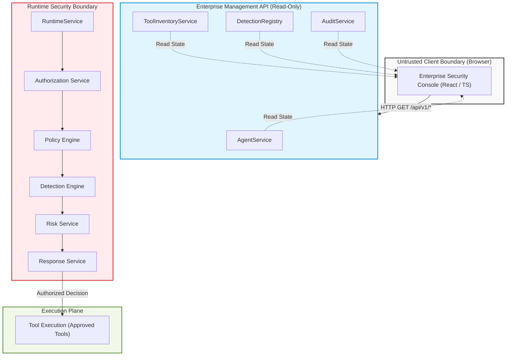

# ADR-009: Enterprise Security Console

- **Status:** Accepted
- **Date:** 2026-07-10
- **Deciders:** Enterprise Agent Security Platform
- **Supersedes:** None
- **Superseded by:** None

---

# Context

The Enterprise Agent Security Platform has successfully established a robust, deterministic runtime security pipeline. To expose platform state and governance metrics, the platform provides:

- **Runtime API:** Handles agent execution, policy evaluation, detection rules, and tool execution inside the runtime security boundary.
- **Enterprise Management API:** Exposes read-only governance, tool inventories, detection rules, and immutable audit logs.

The platform now requires a dedicated user interface—the **Enterprise Security Console**—to provide comprehensive platform visibility, administrative introspection, and audit capabilities.

This console is **not** an autonomous AI agent, nor does it execute model reasoning. Furthermore, it lies entirely outside the **Runtime Security Boundary** and must not participate in policy enforcement, risk decisions, or tool executions.

Instead, the Enterprise Security Console serves as a pure visualization layer over the Enterprise Management API, tailored for:

- **Security Analysts:** To investigate security incidents, alert timelines, and runtime findings.
- **Platform Administrators:** To monitor registered agents, active configurations, and platform status.
- **AI Governance Teams:** To review security framework coverage (OWASP LLM, MITRE ATLAS/ATT&CK) and operational compliance.
- **Security Engineers:** To analyze system threat vectors, policy effectiveness, and simulation runs.

---

# Scope

This decision record strictly governs:

- **Frontend Architecture:** Structure, dependencies, components, and build-tooling choices.
- **Browser Trust Model:** Security boundaries and authorization assumptions for frontend execution.
- **Management API Interaction:** How the client consumes data from the backend control plane.
- **UI Design Principles:** Invariants to ensure consistent visual aesthetics and user experience.
- **Page Architecture:** Structural layout and primary views of the application.

This decision record **does not** govern:

- **Runtime Execution:** The mechanics of running agent sessions or invoking LLM providers.
- **Tool Execution:** The invocation of executable tools or workspace virtualization.
- **Authorization Logic:** The evaluation of agent identity and resource permissions.
- **Policy/Detection Evaluation:** The execution of policy rules or detection heuristics.

These runtime mechanisms remain entirely backend-driven and are governed by previous ADRs (ADR-001 through ADR-008).

---

# Decision

To support a highly responsive, maintainable, and type-safe user interface, the Enterprise Security Console shall be built using the following modern web stack:

- **React:** Chosen for declarative UI component rendering, component-driven reusability, and its massive ecosystem of charting and data visualization libraries.
- **TypeScript:** Enforces strict compile-time typing of all API payloads, state schemas, and component interfaces, minimizing runtime frontend errors.
- **Vite:** Serves as the build tooling and development server, offering fast hot module replacement (HMR), optimized production bundling, and fast startup times.
- **Tailwind CSS:** Provides utility-first, performant styles to build sleek, cohesive, responsive layouts without stylesheet bloat.
- **React Router:** Handles client-side routing, route protections, layout inheritance, and page navigation structures.
- **Axios:** Handles HTTP network requests, enabling unified request/response interceptor management, client timeout configurations, and structured error propagation.

### Trade-offs

- **Client-Side Rendering (CSR):** Building a React Single Page Application (SPA) using Vite simplifies deployment and hosting (can be served from static object storage or embedded inside FastAPI static files). However, CSR shifts routing and rendering compute to the user's browser, which is acceptable since the console is an internal enterprise tool rather than a public-facing SEO-dependent site.
- **Separate Build step:** Introduces a compilation step (Vite build) to compile TSX into JS/CSS, adding frontend-specific build tooling to the deployment pipeline.

---

# Architectural Separation

The following diagram illustrates the complete architectural isolation of the Enterprise Security Console from the Runtime Security Boundary:

The browser **never** interacts directly with the Runtime Security Boundary or the Tool Execution Plane. All observability data is routed strictly through the read-only Enterprise Management API.

---

# Trust Boundaries

## Boundary 1 – Browser (Untrusted Client)
The host browser executing the console application is considered a completely untrusted environment. No sensitive secrets (e.g., API keys, administrative master credentials) may reside in client-side code, storage, or memory. All client inputs must be validated by the API plane.

## Boundary 2 – Enterprise Security Console
The console is a pure presentation layer. It does not perform security checks, parse LLM intent, evaluate rules, or decide whether a tool call is safe. It merely visualizes decisions that have already been made deterministically on the backend.

## Boundary 3 – Enterprise Management API
The Management API acts as a read-only gateway. It permits the console to query governance registries and logs without exposing any mutation capability or direct tool access.

## Boundary 4 – Runtime Security Boundary
RuntimeService remains the sole authoritative Policy Decision Point (PDP) and Policy Enforcement Point (PEP) for agent executions. The console has no pathway to invoke this service or alter its execution pipeline.

## Boundary 5 – Tool Execution
Executable tools are fully isolated inside backend runner environments and are triggered only via verified runtime workflows. The console has no visibility or interaction with executable tool handles.

---

# Security Principles

## Thin Client
The console contains zero security enforcement logic or business rules. It fetches, formats, and displays backend data. If a page displays whether a tool invocation was blocked, it relies entirely on the response payload fields sent by the backend.

## Read-only Console
The console does not provide write controls, configuration updates, or execution triggers. It never executes tools, runs tests, or triggers agent iterations. It is strictly an observation deck.

## Runtime Authority
All policy, risk, and detection decisions remain deterministic and backend-enforced. The console never overrides a decision or attempts to evaluate whether an agent has authorization.

## Zero Trust UI
All users accessing the console are assumed untrusted. The Enterprise Management API is designed to require JWT authentication. Authentication enforcement is planned before production-oriented releases. Until then, the current implementation should be considered a development environment rather than a production deployment.

## Provider Agnostic
The user interface represents agents, tools, and detections using abstract platform entities. The presentation layer remains completely independent of whether backend operations are executing models from Gemini, Ollama, OpenAI, Anthropic, DeepSeek, or other providers.

## Domain-driven UI
UI layouts, page structures, and tables are structured around core platform concepts (Agents, Tools, Policies, Audit Logs, Findings) rather than raw database schemas, service singletons, or internal serialization details.

## Rendering Untrusted Content
The UI must treat all dynamic data rendered from the server as untrusted content, including user prompts, model outputs, tool outputs, findings, and audit metadata. To mitigate Cross-Site Scripting (XSS) and injection vulnerabilities, the console must strictly rely on framework-provided output escaping. Any future support for rendering rich content (e.g. HTML or markdown output) must include dedicated sanitization processing. Future deployments should also enforce a strict Content Security Policy (CSP) header.

---

# Initial Pages

The Console shall implement the following initial views:

- **Dashboard:** A central landing page displaying high-level security metrics: total active agents, tool counts, registered detection rules, historical audit volume, and recent high-severity security findings.
- **Agents View:** A searchable catalog listing all registered agents, their current status (Active, Suspended, etc.), designated owner, risk tier, and their allowed tool authorization scopes.
- **Tools View:** An inventory displaying registered tools, version metadata, descriptions, capability levels, and associated governance/operational profiles.
- **Detection Rules View:** A grid of active security rules (Prompt Injection, Sensitive File Access, Data Exfiltration, etc.) describing their detection categories and descriptions.
- **Audit Timeline:** An immutable chronological log showing runtime tool invocation decisions (Allow/Deny/Approval Required) mapped against timestamps. In initial versions, this page visualizes Audit Events as flat records. Session correlation is planned for future versions once session identity is integrated into the underlying audit event model.
- **Coverage View (Roadmap):** A planned compliance matrix displaying the platform's detection rule capabilities mapped against security standards (OWASP Top 10 for LLM, MITRE ATLAS). This view depends on future Management API capabilities to aggregate and serve rule coverage stats.
- **Findings View (Roadmap):** A planned alert screen displaying security violations flagged by the Detection Engine. This view will be introduced in future releases once persistent storage for detection findings is implemented at the backend.

---

# API Consumption

The console consumes data strictly via client requests to the Enterprise Management API. 

The console consumes the following currently implemented endpoints:
- `GET /api/v1/info` (replacing the dashboard view with lightweight platform summary stats)
- `GET /api/v1/agents`
- `GET /api/v1/tools`
- `GET /api/v1/detection/rules`
- `GET /api/v1/audit/events`

The following endpoints are defined as future Management API capabilities:
- `GET /api/v1/dashboard`
- `GET /api/v1/findings`
- `GET /api/v1/coverage`

The frontend code **must not** construct routes or request payloads targeted at the Runtime API (`POST /agents/{agent_id}/execute`). The console binary must not contain code dependencies or references that allow direct execution requests.

---

# UI State Management

UI state architecture is governed by the following core guidelines, leaving the specific library implementation open to the development team:

- **UI State vs. Server Cache:** The client must clearly separate local UI state (e.g., search queries, open dropdowns, tab selections) from cached server state (e.g., lists of agents or audit events).
- **Structured Loading States:** Every asynchronous API request must expose explicit loading structures in the UI (e.g., skeletons or progress indicators) to prevent layout shifts.
- **Graceful Error Handling:** Network and API validation errors must be handled gracefully at the routing or view boundary, displaying user-friendly error messages without crashing the application interface.
- **Revalidation Policy:** Server cache data should be updated periodically or upon user navigation to maintain state freshness without overloading the read-only API plane.

---

# Consequences

## Advantages
- **Separation of Concerns:** The presentation layer is decoupled from security enforcement and data persistence, reducing complexity.
- **Thin Client:** Simplifies testing, security auditing, and maintenance by keeping the React app lightweight and stateless.
- **Stable APIs:** The console depends on public versioned API endpoints, allowing internal services to refactor safely.
- **Enterprise Scalability:** Observability workloads can evolve independently from runtime execution and will support horizontal scaling once persistent shared storage is introduced.
- **Independent Frontend Evolution:** Designers and frontend engineers can iterate on console aesthetics and UX without touching security-critical python code.

## Trade-offs
- **Two API Planes:** Requires maintaining separate routing patterns for execution and observability.
- **Additional Frontend Project:** Introduces JavaScript build tooling, node dependencies, and build pipelines alongside the Python environment.
- **Separate Deployment Lifecycle:** The frontend must be packaged, versioned, and deployed independently of the Python backend (e.g., as a static bundle).

---

# Future Work

The baseline console architecture will support the future addition of the following capabilities, subject to backend prerequisites:

- **Live Runtime Monitor (Requires backend event streaming):** WebSocket-driven live execution feeds visualizing tool invocations and findings in real time.
- **Session Explorer (Requires backend session ownership validation):** Deep-dive timeline view of complete multi-turn agent conversations, tracing model responses and tool executions.
- **Policy Viewer:** Read-only inspection of active access control and resource authorization policies.
- **Risk Explorer:** Graphical representation of risk assessments, showing score trends and risk level breakdowns.
- **Provider Dashboard (Requires backend provider telemetry):** Charts showing provider usage distribution across different LLM platforms (e.g., Gemini, Ollama).
- **Model Governance:** Registration logs mapping models to specific tasks and authorized risk boundaries.
- **Multi-Agent Visualization:** Flow diagrams depicting collaboration topology and trust boundaries between cascading agents.
- **SIEM Integrations:** Export utilities and configuration screens for enterprise logging pipelines.
- **Findings and Threat Metrics (Requires backend persistent findings storage):** Tracking and history of rule violations over time.
- **Security Tooling Results:** Integration panels presenting evaluations from Promptfoo, Microsoft PyRIT, NVIDIA Garak, and Meta Purple Llama.

---

# Architectural Constraints

To preserve the platform's security posture, the Enterprise Security Console **must not**:

1. **Execute tools** or resolve executable base tool references.
2. **Invoke RuntimeService** or initiate execution requests.
3. **Invoke LLM providers** directly or parse unstructured text.
4. **Perform authorization** checks on behalf of the runtime plane.
5. **Evaluate security policies** or detection rules.
6. **Mutate audit records** or findings state.

The console is structurally constrained to be a passive, read-only observer.

---

# Cross-reference Existing ADRs

This ADR builds upon and aligns with:

- **ADR-001: Zero Trust Security Model:** Treats the browser environment as completely untrusted, establishes the Zero Trust principle that every request must eventually be authenticated and authorized by the backend.
- **ADR-004: Deterministic Security Pipeline:** Respects the terminal nature of audit logging, consuming the output events without bypassing or interfering with the pipeline.
- **ADR-005: Centralized Tool Registry:** Consumes tool registry inventories only as deep-copied, read-only metadata objects (`ToolMetadata`), never interacting with executable tool logic.
- **ADR-008: Enterprise Management API:** Establishes the target read-only management endpoints consumed by the console.
