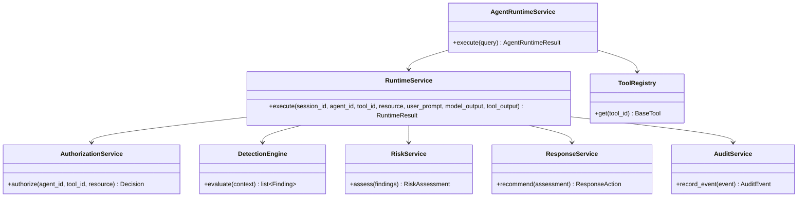
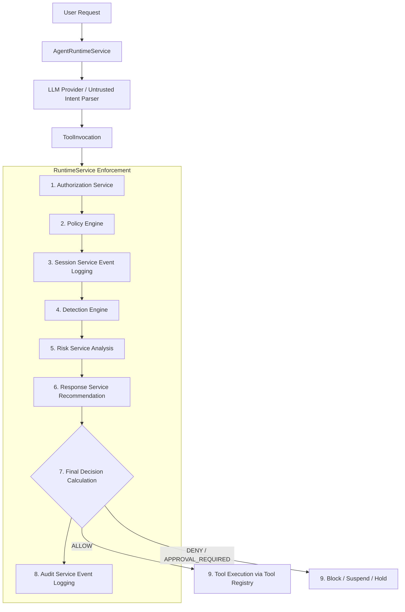
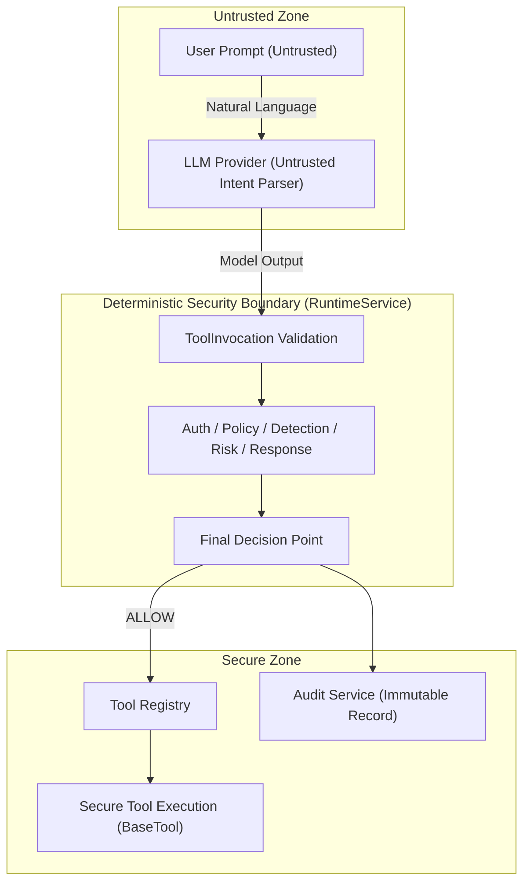

# Enterprise Agent Security Platform

## Overview

The Enterprise Agent Security Platform provides governance, authorization, visibility, risk management, and monitoring controls for AI agents operating within enterprise environments.

The platform assumes that AI agents are not trusted security boundaries. All agent actions must be evaluated through centralized security controls before interacting with enterprise tools.

---

# Problem Statement

Organizations are increasingly deploying AI agents with access to:

- Internal documents
- Source code repositories
- Ticketing systems
- Enterprise APIs
- File systems
- Cloud resources

Without governance and security controls, these agents may:

- Access unauthorized data
- Perform privileged actions
- Exfiltrate sensitive information
- Generate untraceable activity
- Operate without visibility

The platform addresses these challenges through policy enforcement, authorization, auditing, and detection capabilities.

---

# Design Principles

## Zero Trust

Never trust:

- User prompts
- Agent reasoning
- Tool outputs
- Retrieved documents
- External content

All actions must be verified independently.

---

## Least Privilege

Agents receive only the minimum permissions required to perform their tasks.

---

## Full Auditability

Every action must be traceable.

Questions that should always be answerable:

- Who performed the action?
- Which agent initiated it?
- Which tool was used?
- Why was it allowed?
- What was the risk score?
- Which session did it belong to?

---

## Deterministic Security

Authorization and risk decisions should be deterministic and explainable.

Security-critical decisions should not depend solely on LLM output.

The LLM is treated as an untrusted intent parser. All authorization, policy evaluation, risk assessment, and response decisions are performed by deterministic platform services.

---

## Provider-agnostic Architecture

LLM providers are infrastructure dependencies rather than security boundaries.

The platform isolates provider-specific implementations behind a common `ProviderAdapter` interface, allowing new providers to be integrated without modifying the runtime, authorization, policy, detection, risk, response, or tool execution components.

Provider selection is configuration-driven and independent of the deterministic security pipeline.

---

# Target Reference Architecture

The following diagram represents the long-term target architecture of the Enterprise Agent Security Platform.

Several components shown below, including the Agent Gateway, Management Console, and adaptive security controls, are planned for future releases and are not yet part of the current implementation.

```text
Security Analysts / Administrators
                    ↓
         Web Management Console
                    ↓
                FastAPI API
                    ↓
                Agent Gateway
                    ↓
           Authorization Service
                    ↓
               Policy Engine
                    ↓
             Session Context
                    ↓
               Tool Registry
                    ↓
             Enterprise Tools
                    ↓
              Audit Pipeline
                    ↓
             Detection Service
                    ↓
                Risk Service
                    ↓
      Adaptive Security Controls
                    ↺
           Authorization Service
```

---

# Current Implementation Architecture

The current implementation supports a single enterprise agent with pluggable, provider-agnostic LLM providers. The execution pipeline enforces Zero Trust security controls deterministically outside of the LLM.

### Static Component Architecture

The following diagram illustrates the relationships between the major architectural components.



### Runtime Security Pipeline

The `RuntimeService` is the single authoritative security decision point in the system. The runtime pipeline executes as follows:



### Runtime Decision Flow

The relationship between the security services is deterministic and hierarchical:
1. **Authorization & Policy**: Form the baseline access control checking if the agent is allowed to request the tool/resource.
2. **Detection & Behavioral Analysis**: Scan the raw runtime context (prompts, outputs, metadata) for active threat indicators.
3. **Risk Scoring & Response Recommendation**: Map the volume and severity of findings to response actions (MONITOR, ALERT, REQUIRE_APPROVAL, SUSPEND_AGENT).
4. **Final Decision**: If the baseline authorization was `ALLOW`, but risk response dictates restrictive enforcement, `RuntimeService` overrides the decision:
   - `SUSPEND_AGENT` overrides decision to `Decision.DENY`.
   - `REQUIRE_APPROVAL` overrides decision to `Decision.APPROVAL_REQUIRED`.
   - Otherwise, the baseline authorization is preserved.

---

# Trust Boundaries

The platform enforces strict boundaries to isolate untrusted inputs from secure execution contexts:



- **Boundary 1 (User Prompt)**: Treated as untrusted; subject to content scan via `PromptInjectionRule`.
- **Boundary 2 (LLM Output)**: Treated as untrusted payload; parsed into `ToolInvocation` and validated.
- **Boundary 3 (Runtime Security Boundary)**: `RuntimeService` intercepts all calls and evaluates security controls deterministically outside of LLM influence.
- **Boundary 4 (Secure Execution)**: Only after a final `ALLOW` decision is computed can execution proceed via the `Tool Registry`.

---


# Core Components

## `EnterpriseAgent`

The `EnterpriseAgent` defines the abstraction for enterprise AI agents.

Responsibilities:

- Accept natural language requests.
- Delegate prompt processing to the configured provider.
- Convert provider responses into validated ``ToolInvocation`` objects.

The `EnterpriseAgent` does **not** perform:

- Authorization
- Policy evaluation
- Risk assessment
- Detection
- Response enforcement
- Tool execution

The `EnterpriseAgent` is treated solely as an intent parser within the deterministic security pipeline.

---

## `ProviderAdapter`

The `ProviderAdapter` defines a common interface for all supported LLM providers.

Responsibilities:

- Submit prompts to an LLM provider.
- Receive structured responses.
- Abstract provider-specific SDKs and APIs.

Current implementations:

- OllamaProvider
- GeminiProvider

Future providers can be integrated by implementing the `ProviderAdapter` interface without modifying the runtime or security pipeline.

---

## `ProviderFactory`

The `ProviderFactory` is responsible for selecting and constructing the configured LLM provider.

Responsibilities:

- Read provider configuration.
- Instantiate the configured `ProviderAdapter`.
- Isolate provider selection from runtime services.

Current supported providers:

- Ollama
- Gemini

The `ProviderFactory` belongs to the application composition layer and is responsible for constructing the configured provider during application initialization. It is not part of the runtime request processing pipeline.

---

## Agent Registry

The platform maintains a centralized inventory of all registered AI agents.

Each agent contains:

- Agent ID
- Business Owner
- Technical Owner
- Purpose
- Business Function
- Associated Model
- Authorized Data Sources
- Risk Tier
- Approved Tools
- Data Classification
- Environment
- Status

The inventory serves as the authoritative source of truth for agent governance, authorization, and risk evaluation decisions.

---

## Agent Gateway

Single entry point for agent requests.

Responsibilities:

- Authentication
- Request validation
- Event generation
- Request routing

Security posture:

- Requests that cannot be validated are rejected.
- Security control failures default to fail-closed behavior.

This component is part of the target architecture and is not yet implemented in the current platform.

---

## Authorization Service

Central authorization component.

Acts as the Policy Decision Point (PDP).

Evaluates:

- Agent identity
- Tool permissions
- Policy rules
- Tool arguments
- Resource access requests
- Risk level
- Agent status
- Data classification requirements

Possible outcomes:

- ALLOW
- DENY
- APPROVAL_REQUIRED

Fail-closed behavior:

If required security controls, policy evaluation, or authorization dependencies are unavailable, authorization defaults to DENY.

Current implementation supports resource-aware authorization policies.

Authorization decisions are deterministic and independent of LLM output.

Examples:

- ALLOW file_read(notes.txt)
- ALLOW file_read(public_data.csv)
- DENY file_read(secrets.txt)

---

## Session Context

Maintains context across a sequence of agent actions rather than evaluating requests in isolation.

Current capabilities:

- Session tracking
- Session isolation

Future capabilities:

- Multi-step activity correlation
- Behavioral analysis
- Detection context generation

Examples:

- Read then exfiltration sequences
- Tool chain escalation
- Repeated denied actions
- Approval workflow abuse

---

## Tool Registry

The Tool Registry is the centralized registry of all executable tools approved for use within the platform.

Every executable tool implements the `BaseTool` abstraction and registers immutable `ToolMetadata` describing its identity, capabilities, governance attributes, and operational characteristics.

The runtime never executes tools directly. Instead, it resolves the requested tool through the Tool Registry after successful authorization, policy evaluation, detection, risk assessment, and response enforcement.

Tool Discovery and Tool Inventory services expose only `ToolMetadata`; executable tool instances remain behind deterministic security controls.

The Tool Registry is the only component authorized to resolve executable tool instances.

The Tool Registry represents the single trust boundary between the deterministic security pipeline and executable tool implementations.

---

## Secure Tool Execution

Secure Tool Execution is responsible for executing the resolved `BaseTool` implementation returned by the Tool Registry.

Execution occurs only after deterministic authorization, policy evaluation, session validation, detection, risk assessment, and response enforcement have succeeded.

The runtime never instantiates or executes tool implementations directly; all executable tools are obtained from the Tool Registry.

Current implementations:

* FileReadTool
* DirectoryListTool

Future implementations may include:

* Shell execution
* External API tools
* GitHub integrations
* Browser automation
* Enterprise SaaS connectors

---

## Model Registry

The Model Registry maintains a centralized inventory of approved AI models used by enterprise agents.

Tracked attributes:
- Model ID (name / identifier)
- Provider
- Version
- Risk Classification
- Approval Status

The Model Registry serves as the authoritative source of truth for approved AI models within the enterprise.

---

## Runtime Audit

The platform integrates two distinct event-tracking layers to handle auditing and behavioral analysis:

1. **`SessionService` (Stateful / Behavioral Tracker)**:
   * **Role**: Tracks security-relevant events within an active session lifecycle.
   * **Characteristics**: Stateful.
   * **Use Case**: Used dynamically by detection rules (such as `detect_excessive_denials`) to analyze sequential access patterns and detect brute-force or abuse behaviors.
2. **`AuditService` (Append-Only / Compliance Log)**:
   * **Role**: Captures immutable audit records of all runtime request decisions.
   * **Characteristics**: Stateless, append-only, decoupled from runtime logic.
   * **Use Case**: Logs final, authoritative execution decisions (ALLOW, DENY, APPROVAL_REQUIRED) and caller/tool metadata, serving as the official record for SIEM ingestion and security compliance.

---

## Detection Architecture

The platform implements a stateless, deterministic detection framework to scan agent queries, model intents, and tool execution environments for threat indicators.

```
DetectionRule ──> RuleMetadata ──> DetectionRegistry ──> DetectionEngine
```

### Components

- **`DetectionRule`**: A protocol defining the standard interface for threat detection rules. Each rule implements `evaluate(context)` and returns a list of `Finding` events.
- **`DetectionCategory`**: Enums that group detection rules into stable, high-level threat families:
  * `PROMPT_SECURITY` — Prompt injections, jailbreaks, instruction overrides
  * `DATA_SECURITY` — Sensitive data access, exfiltration attempts
  * `TOOL_SECURITY` — Unauthorized tool execution, argument abuse
  * `IDENTITY_SECURITY` — Agent spoofing and impersonation
  * `BEHAVIORAL_SECURITY` — State-based violations (e.g. excessive denials)
  * `POLICY_SECURITY` — Static policy rule breaches
- **`RuleMetadata`**: A frozen, immutable dataclass containing the rule's metadata (name, category, description, and mapped framework references).
- **`DetectionRegistry`**: A central discovery and lookup component to register and retrieve active detection rules.
- **`DetectionEngine`**: A stateless orchestrator that executes all registered detection rules against a request's `DetectionContext`.

### Determinism and Statelessness

Detection rules are intentionally **stateless** and **deterministic**. They evaluate the provided `DetectionContext` (representing a single snapshot of the prompt, model output, and tool output) without maintaining local execution state. This guarantees thread-safety, predictable execution times, and prevents side effects. Behavioral detection (e.g. correlating events across time) is delegated to services analyzing session events tracked by the stateful `SessionService`.

---

## Security Standards Mapping

The platform maps detection rules to industry-standard security frameworks to support incident response, threat hunting, and compliance reports.

### Mappings
- **OWASP LLM Top 10**: Mapped via control ID (e.g. `LLM01` for Prompt Injection).
- **MITRE ATLAS**: Adversarial threat techniques (e.g. `AML.T0043` for User Prompt Injection).
- **MITRE ATT&CK**: Mapped to standard attacker techniques (e.g. `T1083` for File Discovery, `T1048` for Exfiltration Over Alternative Protocol).

### Architectural Posture
Mappings exist **purely as metadata** within each rule's `RuleMetadata`. Mappings are not involved in runtime execution logic or threat detection, keeping the core detection pipeline simple and fast.

---

## Risk & Response Services

Calculates risk levels and recommends actions based on detection findings:

1. **`RiskService`**: Aggregates all findings generated during execution and calculates a combined risk score by summing static severity weights (`LOW = 10`, `MEDIUM = 25`, `HIGH = 50`, `CRITICAL = 100`). The score determines the `RiskLevel` (`LOW`, `MEDIUM`, `HIGH`, `CRITICAL`).
2. **`ResponseService`**: Recommends a `ResponseAction` based on the calculated risk level:
   * `LOW` risk level maps to `ResponseType.MONITOR`
   * `MEDIUM` risk level maps to `ResponseType.ALERT`
   * `HIGH` risk level maps to `ResponseType.REQUIRE_APPROVAL`
   * `CRITICAL` risk level maps to `ResponseType.SUSPEND_AGENT`

These recommendations are passed back to the `RuntimeService`, which enforces the overrides.

---


## Security Agent (Future Capability)

The platform includes a defensive security-focused agent.

Unlike business agents, the Security Agent does not execute enterprise actions.

Security Agent recommendations are advisory and do not directly influence authorization decisions.

The Security Agent is subject to the same auditing, authorization, governance, and monitoring controls as business agents.

Instead, it:

- Reviews findings
- Explains risk
- Recommends mitigations
- Assists incident triage

Example:

Finding:
15 denied GitHub write attempts in 10 minutes.

Recommendation:

- Disable Agent
- Require Approval Workflow
- Investigate Credentials

---

## Management Console (Future Capability)

The platform includes a web-based management console for security analysts and administrators.

The console provides visibility into:

- Agent Registry
- Agent Risk Scores
- Security Findings
- Approval Workflows
- Policy Violations
- Audit Events
- Platform Health

The management console serves as the primary user interface for governance and operational security workflows.

Future implementation will use:

- Next.js
- TypeScript
- Tailwind CSS
- shadcn/ui

---

## AI Asset Inventory

The platform maintains an inventory of enterprise AI assets.

Current Assets

- Agents
- Tools

Planned Assets

- Models
- Knowledge Sources
- Vector Stores

Tracked asset categories:

- Agents
- Models
- Tools
- Knowledge Sources
- Vector Stores
- External AI Services

Inventory metadata may include:

- Owner
- Business Function
- Risk Classification
- Approval Status
- Environment
- Registration Date
- Lifecycle Status


The inventory provides governance, visibility, risk management, and auditability across the enterprise AI ecosystem.

---

## Identity & Traceability

Every action should be traceable end-to-end.

Traceability chain:

User
 ↓
Agent
 ↓
Session
 ↓
Tool
 ↓
Decision
 ↓
Audit Event

The platform should enable investigators to determine:

- Who initiated the activity
- Which agent performed the action
- Which session contained the activity
- Which tool was executed
- Which policy influenced the decision
- Which audit events were generated

---

## Control Effectiveness

The platform measures whether security controls are functioning as intended.

Example metrics:

- Policy Hit Rate
- Denied Requests
- Approval Requests
- Detection Findings
- Authorization Outcomes
- Control Coverage

The goal is to evaluate control effectiveness, not simply control existence.

---

### Planned Console Views

- Agent Registry Dashboard
- Security Findings Dashboard
- Approval Queue
- Risk Monitoring
- Audit Timeline

---

# Future Enhancements

The platform is designed to support additional AI security capabilities.

Planned future enhancements include:

- Security posture scoring
- Agent security maturity assessments
- Session-based behavioral analysis
- Indirect prompt injection detection
- Attack simulation framework
- Advanced resource-aware authorization policies
- Risk-adaptive authorization
- Multi-agent governance controls
- Shadow AI discovery
- Unauthorized model detection
- Unregistered agent detection

---

# Implementation Roadmap

## Current Status

### Implemented

#### Core Runtime & Registries
- `EnterpriseAgent`
- `AgentRuntimeService` (thin orchestrator)
- `RuntimeService` (single authoritative security decision point)
- Agent Registry
- Tool Registry (with `BaseTool` abstraction and rich metadata)
- Model Registry
- Detection Registry
- Tool Discovery and Tool Inventory Service

#### Provider Architecture
- `ProviderAdapter` and `ProviderFactory`
- Ollama and Gemini Providers
- Provider-agnostic Tool Selection

#### Security Controls & Auditing
- JWT Authentication and Role-Based Access Control (RBAC)
- Authorization Service and Policy Engine (resource-aware authorization)
- `SessionService` (stateful event logging)
- `AuditService` (immutable, append-only audit logging)
- Secure Tool Execution (`FileReadTool`, `DirectoryListTool`)

#### Detection & Risk Framework
- stateless, deterministic `DetectionEngine`
- `PromptInjectionRule` (OWASP LLM01, MITRE ATLAS user prompt injection)
- `SensitiveFileAccessRule` (MITRE ATT&CK file discovery)
- `DataExfiltrationRule` (MITRE ATT&CK exfiltration)
- `RiskService` (severity-based risk assessment)
- `ResponseService` (maps risk levels to enforcement actions)

### Planned

- REST API Expansion
- Enterprise Management Console
- Observability integration (OpenTelemetry, Prometheus, Grafana, Jaeger)
- Multi-Agent Governance
- External assessment tool integrations (Promptfoo, NVIDIA Garak, Microsoft PyRIT, PurpleLlama, Giskard)


---

# Architectural Decision Summary

The architecture of the Enterprise Agent Security Platform is based on four fundamental principles:

1. LLMs are treated as untrusted intent parsers.

2. All authorization, policy evaluation, detection, risk assessment, and response decisions remain deterministic and auditable.

3. Provider-specific implementations are isolated behind provider-agnostic abstractions.

4. Executable tools are governed through a centralized Tool Registry that separates metadata, discovery, inventory, and execution while preserving Zero Trust principles.

These principles guide all future architectural decisions and ensure the platform remains provider-agnostic, secure, and maintainable as additional enterprise capabilities are introduced.