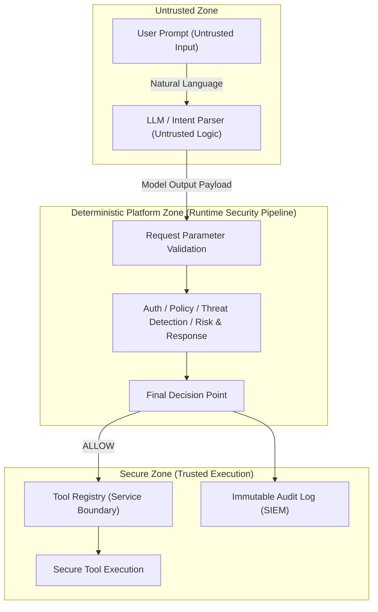
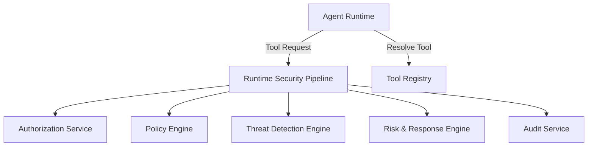

# Enterprise Agent Security Platform — Technical Architecture Reference

## 1. Overview
The Enterprise Agent Security Platform provides a robust runtime governance, authorization, visibility, risk management, and threat mitigation boundary for autonomous AI agents operating within enterprise environments. 

Rather than acting as another agent framework, this platform functions as a security gateway that intercepts, evaluates, and enforces policy controls over agent actions. The platform operates on the baseline assumption that AI components are not trusted security boundaries, ensuring all interactions with enterprise tools are subject to deterministic security validation.

## 2. Problem Statement
Deploying autonomous AI agents with access to internal documents, code repositories, databases, file systems, and enterprise APIs presents significant security risks. Without a centralized, deterministic governance layer, agents are vulnerable to:
*   **Adversarial Intent Alignment:** Executing unauthorized data reads or system modifications due to prompt injection or jailbreak payloads.
*   **Privilege Escalation:** Running restricted administrative operations or bypassing access controls.
*   **Data Leakage and Exfiltration:** Moving sensitive internal resources to unapproved external endpoints.
*   **Audit Deficits:** Executing actions that produce unstructured, non-reputable, or untraceable activity logs, rendering forensic response impossible.

## 3. Architectural Principles
The platform's technical design is governed by the following core principles:
*   **Zero Trust Architecture:** Every runtime transition, parameter value, and tool execution request is explicitly authenticated, authorized, analyzed, and audited. No internal agent state is implicitly trusted.
*   **LLM as an Untrusted Intent Parser:** The natural language model is treated as an untrusted client whose only job is to map user statements to structured requests. It has no authority to make policy or security decisions.
*   **Deterministic Security Enforcement:** All policy checking, threat detection, risk calculations, and mitigation overrides are computed outside the LLM in deterministic, compiled/interpreted code.
*   **Least Privilege Access:** Agents are restricted to the minimal set of approved tools and resource parameters necessary for their defined business roles.
*   **Separation of Reasoning & Enforcement:** The Agent Runtime is strictly isolated from the Runtime Security Pipeline (gatekeeper), preventing model behaviors from overriding security decisions.
*   **Complete Auditability:** Every tool request, authorization decision, policy evaluation, and mitigation action is logged as an immutable, append-only audit record suitable for ingestion by enterprise SIEM platforms.
*   **Provider-Agnostic Design:** LLM providers are treated as interchangeable backend utilities. The platform abstracts provider-specific interfaces behind clean adapters, ensuring security logic is unaffected by model swaps.

## 4. Trust Boundaries
The platform enforces strict boundaries to isolate untrusted inputs and model logic from secure execution zones and enterprise resources:



*   **Untrusted Zone:** Houses the user prompt (susceptible to indirect/direct injection) and the LLM (susceptible to instruction overrides and hallucinations). All outputs crossing this boundary are treated as untrusted payloads.
*   **Deterministic Platform Zone:** Intercepts and parses incoming requests. Evaluates access permissions, checks compliance against enterprise policies, runs threat rules, and scores risk. Security decisions are finalized here.
*   **Secure Execution Zone (Trusted):** Contains the registries and execution routines. Executable tool instances reside securely behind this boundary. Tool execution is triggered only upon receiving an explicit `ALLOW` decision.

## 5. Target Reference Architecture
The long-term target architecture introduces an API Gateway and an Agent Gateway, serving as centralized ingress points for multiple agents, supported by a React-based management console for policy configuration and human-in-the-loop approvals:

```text
       Security Analysts / Administrators
                       ↓
            Web Management Console
                       ↓
             Management REST APIs
                       ↓
                 Agent Gateway
                       ↓
           Runtime Security Pipeline
                       ↓
                 Tool Registry
                       ↓
               Enterprise Tools
                       ↓
           Audit Log & SIEM Pipeline
```

## 6. Current Implementation Architecture
The current implementation focuses on a single-agent, provider-agnostic execution environment. A deterministic gateway intercepts agent tool requests and executes them only after evaluation against security controls.

### Static Block Architecture
The diagram below illustrates the relationship between the primary components:



## 7. Runtime Security Lifecycle
Every interaction with the platform follows a strict, canonical lifecycle to ensure zero trust verification:

```text
[User Request] 
       ↓
[Agent Runtime] 
       ↓
[Provider Adapter]          (Invokes the configured LLM provider)
       ↓
[Tool Invocation]           (Model parses user intent and outputs requested tool & arguments)
       ↓
====================== SECURITY PIPELINE BOUNDARY ======================
       ↓
[Authorization Check]       (Verifies agent-to-tool permissions)
       ↓
[Policy Evaluation]         (Validates resource parameters against rules)
       ↓
[Session Tracking]          (Logs transient event to trace behavioral patterns)
       ↓
[Threat Detection]          (Stateless rules scan input/output payloads)
       ↓
[Risk Assessment]           (Scores active findings by severity weight)
       ↓
[Response Recommendation]   (Recommends MONITOR, ALERT, APPROVAL, or SUSPEND)
       ↓
[Final Decision Overrides]  (Applies enforcement logic to compute outcome)
       ↓
[Immutable Audit Record]    (Logs final decision and metadata to SIEM)
       ↓
====================== SECURE EXECUTION BOUNDARY ======================
       ↓
[Tool Registry Resolution]  (Resolves executable tool instance if ALLOWed)
       ↓
[Secure Tool Execution]     (Executes action and returns output)
```

## 8. Major Components
*   **Agent Runtime:** Coordinates LLM calls and maps intent to tool parameters. Acts purely as an orchestration client and has no security enforcement responsibilities.
*   **Provider Adapter:** Translates standard agent requests into model-specific API calls (e.g., Ollama, Gemini), decoupling reasoning logic from provider SDKs.
*   **Runtime Security Pipeline:** The core controller that orchestrates the execution of authorization, policy, threat detection, and risk-based mitigation rules.
*   **Authorization & Policy Engine:** A deterministic engine that matches caller identity, requested tool IDs, and resource path arguments against security policies.
*   **Threat Detection Engine:** Runs a suite of stateless rules to identify threat signatures in prompts, payloads, and parameter states.
*   **Risk & Response Engine:** Aggregates triggered findings, computes risk scores, and maps risk levels to mitigation actions (such as Alerting or Agent Suspension).
*   **Tool Registry:** The authoritative service that stores metadata and controls access to executable tool code.

## 9. Component Relationships
The interaction sequence flows from natural language parsing to secure tool execution:
1. The **Agent Runtime** passes the prompt through the **Provider Adapter** to parse intent.
2. The resulting **Tool Invocation** is passed to the **Runtime Security Pipeline**.
3. The pipeline verifies access against the **Authorization & Policy Engine**, scans payloads with the **Threat Detection Engine**, and computes overrides via the **Risk & Response Engine**.
4. If approved, the pipeline permits the agent to query the **Tool Registry** to resolve the tool.
5. The tool runs in the **Secure Execution Zone**, logging outcomes via the **Audit Service**.

## 10. Security Architecture
The platform's security architecture enforces baseline access controls combined with real-time behavioral and payload threat evaluation.

### Security Decision Flow
The runtime security pipeline executes decisions progressively:

```text
Authorization → Policy Evaluation → Threat Detection → Risk Assessment → Response Recommendation → Final Decision → Secure Tool Execution
```

Each stage contributes additional security evidence to the context. A critical property of this decision flow is that it is progressively more restrictive: later stages can increase execution restrictions or escalate mitigation response parameters, but they can never weaken or override an earlier denial or restriction. The LLM has no participation in this security decision flow, preserving deterministic, zero trust enforcement.

### Deterministic Policy Enforcement
Authorization is resource-aware and verified independently of the LLM. If the policy specifies that an agent is denied access to a file path (e.g., `secrets.txt`), the pipeline rejects the execution block immediately.

### Threat Detection Rules
The threat engine executes stateless rules to identify indicators of abuse:
*   *Prompt Injection Detection:* Evaluates prompts and model responses for override sequences.
*   *Sensitive File Access Detection:* Scans file resource paths for protected system files (`.env`, private keys).
*   *Data Exfiltration Detection:* Flags the concurrent presence of exfiltration targets and sensitive datasets.

### Risk-Adaptive Response Recommendations
Triggered findings map to risk levels, which determine the final override action:
*   `LOW` risk maps to `MONITOR` (log and allow).
*   `MEDIUM` risk maps to `ALERT` (log alert and allow).
*   `HIGH` risk maps to `REQUIRE_APPROVAL` (hold for analyst review).
*   `CRITICAL` risk maps to `SUSPEND_AGENT` (override decision to `DENY`).

## 11. Provider Architecture
Model interaction is isolated behind Provider Adapters, separating natural language processing from the security runtime. Provider Adapters handle raw client initialization, connection timeouts, and structure parsing, outputting standard **Tool Invocation** objects.

Reasoning providers act as interchangeable infrastructure components. Changes to the underlying models or Provider Adapters do not affect the security pipeline, as provider-specific SDKs are isolated behind the adapters, ensuring the deterministic security rules remain entirely provider-independent.

## 12. Tool Governance
The Tool Registry acts as the authoritative control plane for all executable capabilities. Rather than simply acting as a metadata store, it regulates the capability inventory, metadata definitions, secure tool resolution, and controlled access to executable tool implementations.

The platform separates tool discovery, tool inventory, and secure tool execution:
*   **Tool Inventory & Discovery:** Exposes only tool metadata (name, description, required roles, capability classification) to agents and management interfaces.
*   **Tool Execution:** Executable code instances are kept isolated inside the Secure Zone. The Agent Runtime cannot instantiate tools directly; it must obtain authorized instances from the registry, which only releases them upon pipeline approval.

## 13. Runtime Audit Architecture
The platform enforces a clear separation between stateful operational logs and compliance-ready audit logs:
*   **Session Tracking Service (Stateful):** Maintains transient context and sequential tracking data during active sessions. Used by detection rules to identify stateful patterns (e.g., brute-force tool denials).
*   **Audit Service (Append-Only):** Captures immutable records of all final security pipeline decisions, metadata, and execution outcomes. Write-only for runtime components, designed for direct ingestion by enterprise SIEM tools.

## 14. Extension Points
*   **Threat Detection Rules:** Developers can integrate custom threat detection logic by implementing standard rule evaluation interfaces and registering rule metadata.
*   **LLM Providers:** Integrate new models by implementing standard provider adapter interfaces.
*   **Tool Integrations:** Register new custom enterprise capabilities through the Tool Registry by supplying operational metadata.
*   **Resource Policies:** Author policies to restrict tool parameters and arguments.

## 15. Future Architecture
Planned updates to the platform include:
*   **Agent Gateway:** Standardized API ingress routing and rate limiting.
*   **Management Console:** A React-based interface for policy configuration, finding dashboards, and approval queues.
*   **Security Agent:** An advisory assistant reviewing findings and recommending policy adjustments.
*   **Risk-Adaptive Authorization:** Dynamically restricting permissions based on aggregate agent threat scores.
*   **Multi-Agent Governance:** Future releases will support centralized governance of multiple cooperating AI agents, preserving deterministic authorization, policy checks, and runtime threat detection across multi-agent collaborations.

## 16. Implementation Status
The current release provides the following operational capabilities:
*   **Zero Trust Enforcement:** Centralized Runtime Security Pipeline intercepting agent requests.
*   **Pluggable LLM Providers:** Adapters supporting local models (Ollama) and cloud APIs (Google Gemini).
*   **Threat Detection Engine:** Active detection rules for prompt injection, sensitive file reads, and exfiltration attempts.
*   **Tool Governance:** Centralized Tool Registry exposing metadata and controlling secure tool execution.
*   **Immutable Logging:** Separate session tracking and append-only audit logging.

## 17. Architectural Decision Summary
The platform architecture is built upon the following immutable design choices:
1. LLMs are untrusted intent parsers.
2. Security decisions must remain deterministic and explainable.
3. Component communication is isolated behind provider-agnostic boundaries.
4. Tool execution is governed by a secure registry separating metadata access from execution logic.