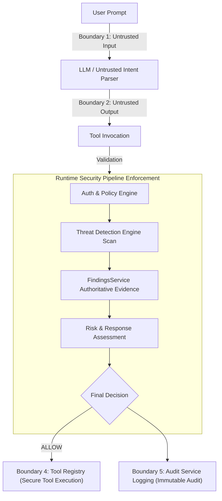

# Threat Model

## Objective

Identify threats against enterprise AI agents and define mitigations within the Enterprise Agent Security Platform.

The platform treats the AI model as an untrusted intent parser. All authorization, policy evaluation, and security decisions are performed by deterministic platform services.

---

## Security Scope

The security boundaries of the platform are defined as follows:

### In Scope
*   **Runtime Governance:** Intercepting and regulating all transactions initiated by enterprise agents.
*   **Authorization & Policies:** Verifying identity, roles, and resource arguments.
*   **Tool Execution Validation:** Restricting execution to verified and approved tool routines.
*   **Enterprise Resource Protection:** Safeguarding workspace files, directories, and external resources.
*   **Agent Interaction Auditing:** Capturing transaction lifecycles for compliance tracing.
*   **Authoritative Findings & Dynamic Risk Governance:** Persisting threat findings and computing isolated cumulative risk posture.

### Out of Scope
*   **Physical Infrastructure:** Underlying hardware security, database server administration, and local operating system configurations.
*   **Cloud Provider Compromise:** Security failures of cloud hosting environments or external network paths.
*   **Human Operational Processes:** Personnel security, manual approval workflow social engineering, and key custody.
*   **General Enterprise IT Controls:** Network routing tables, corporate firewalls, and employee workstation security.

---

## Threat Actors

The platform is designed to defend against the following threat actors:

*   **External Attacker:** Tries to execute prompt injection payloads to trick the agent into running unapproved actions or leaking sensitive files.
*   **Authenticated User:** Tries to leverage their user prompt interface to trigger agent actions exceeding their corporate privileges (e.g., elevation of privilege).
*   **Compromised AI Agent:** The agent runtime, influenced by adversarial instructions, attempts to execute tool chains or access resources outside its authorized footprint.
*   **Malicious Tool:** An unapproved or compromised tool script attempting to bypass execution limits or exfiltrate state variables.
*   **Compromised Provider:** The model adapter endpoint returning manipulated JSON structures or tool-call request arguments.
*   **Insider:** An internal developer or admin tampering with policy configurations or session log states.

---

## Attack Surfaces

The platform's vulnerability exposure is mapped across the following ingress and execution surfaces:

*   **User Prompt Interface:** Direct ingress point for natural language instructions (direct/indirect injection vectors).
*   **Provider Adapter:** Connection point translating AI model outcomes to domain objects.
*   **Tool Invocation:** The parsed request representing agent intent.
*   **Runtime Security Pipeline:** The core policy and threat checking validation pathway.
*   **Tool Registry:** The control plane mapping allowed tools to actual code instances.
*   **Tool Execution:** The zone where resolved capabilities perform filesystem or cloud operations.
*   **Enterprise Resources:** Files, directories, and internal databases targeted by agents.
*   **Audit Subsystem:** Append-only log pipeline recording compliance state.
*   **Management APIs & Security Console:** Control plane endpoints exposing agents, tools, sessions, rules, findings, and risk assessments.

---

## Trust Boundaries

The platform establishes explicit boundaries to contain untrusted inputs and enforce deterministic controls before tool execution:


```mermaid
flowchart TD
    User[User Prompt] -->|Boundary 1: Untrusted Input| LLM[LLM / Untrusted Intent Parser]
    LLM -->|Boundary 2: Untrusted Output| ToolInvoc[Tool Invocation]
    ToolInvoc -->|Validation| SecBoundary["Boundary 3: Runtime Security Pipeline"]
    
    subgraph SecBoundary [Runtime Security Pipeline Enforcement]
        AuthPolicy[Auth & Policy Engine] --> DetEngine[Threat Detection Engine Scan]
        DetEngine --> Findings[FindingsService Authoritative Evidence]
        Findings --> RiskResp[Risk & Response Assessment]
        RiskResp --> FinalDec{Final Decision}
    end

    FinalDec -->|ALLOW| AuthTool["Boundary 4: Tool Registry (Secure Tool Execution)"]
    FinalDec --> Audit["Boundary 5: Audit Service Logging (Immutable Audit)"]
```

### Boundary Descriptions

1. **User Prompt (Untrusted):** The entry point for natural language requests. User input is treated as untrusted and is scanned for malicious overrides (e.g. Prompt Injection).
2. **LLM Output (Untrusted):** The raw response returned by the foundation model. Treated as untrusted and parsed into a validated `ToolInvocation` object.
3. **Runtime Security Pipeline (Deterministic Boundary):** The core entry point where security enforcement happens. Every request must pass through this boundary before executing tools.
4. **Tool Registry & Secure Tool Execution Boundary (Secure Zone):** The trust boundary for resolving registered executable tools. Tool resolution and execution occur only after the Runtime Security Pipeline returns an `ALLOW` decision.
5. **Audit Boundary (Immutable):** The audit logging point. Event recording happens immediately after the final calculated decision, preserving the integrity of compliance logs.

---

## Security Invariants

The platform maintains the following immutable architectural guarantees:
1. **LLM output is never trusted:** ToolInvocation structures are treated as unverified payloads until verified by deterministic rules.
2. **Tool execution always passes through the Runtime Security Pipeline:** No tool can run without explicit authorization check validation.
3. **Authorization precedes execution:** No tool lookup is resolved prior to baseline policy check validation.
4. **Every final decision is audited:** All allow, deny, and approval-held execution outcomes write an append-only log record.
5. **Tool Registry is the only authority for registered executable tools:** The Agent Runtime resolves approved tool invocations through the Tool Registry.
6. **Security decisions remain deterministic:** Security results are calculated by code services, never by AI model prompts.
7. **Later security stages may only increase restrictions:** Pipeline checks can deny or hold requests, but they cannot override earlier denials.
8. **Findings represent authoritative evidence; Risk Assessments represent derived posture:** `FindingsService` persists authoritative findings, while `RiskService` evaluates derived posture for composite `(session_id, agent_id)` keys.

---

## Runtime Security Pipeline

The Runtime Security Pipeline coordinates the progressive validation of every Tool Invocation:

```text
Tool Invocation → Authorization → Policy Evaluation → Threat Detection → Findings → Risk Assessment → Response Recommendation → Final Decision → Audit → Secure Tool Execution
```

Each stage contributes additional security evidence to the context. Collectively, the Runtime Security Pipeline establishes the platform’s primary trust boundary between untrusted AI-generated requests and trusted enterprise capability execution. 

---

## Threat Scenarios (STRIDE Classification)

### Prompt Injection [Tampering / Elevation of Privilege]

#### Threat
An attacker attempts to manipulate the AI model's behavior and bypass application-level boundaries using malicious prompt instructions (e.g., jailbreaking or instruction overriding).

#### Mitigations
- **Prompt Injection Detection Rule:** Scans user prompts and model responses for deterministic prompt injection phrases (`PROMPT_INJECTION`).
- **Threat Detection Engine:** Statelessly runs the context through prompt injection rules to raise findings.
- **Risk & Response Engine:** Aggregates findings and recommends `REQUIRE_APPROVAL` (maps to final decision `APPROVAL_REQUIRED`), preventing the tool from executing until approved.
- **Audit Service:** Logs an immutable `AuditEvent` recording the blocked attempt and final `APPROVAL_REQUIRED` decision.

---

### Sensitive File Access [Information Disclosure]

#### Threat
An agent attempts to access protected system configurations, keys, or credentials on the filesystem.

#### Mitigations
- **Sensitive File Access Detection Rule:** Scans requested resources and user prompts for known sensitive file pattern strings (`SENSITIVE_FILE_ACCESS`).
- **Threat Detection Engine:** Detects these access patterns and raises security findings.
- **Runtime Security Pipeline:** Blocks file access by overriding the final execution decision based on the risk level.
- **Audit Service:** Logs the attempt, target file resource, and the blocked decision.

---

### Data Exfiltration [Information Disclosure / Tampering]

#### Threat
An agent attempts to read sensitive data and transmit it out of the enterprise boundary via an alternate channel or protocol.

#### Mitigations
- **Data Exfiltration Detection Rule:** Tracks the concurrent presence of exfiltration actions and sensitive data indicators (`DATA_EXFILTRATION`).
- **Threat Detection Engine:** Raises a high-severity finding if both exfiltration indicators are present.
- **Risk & Response Engine:** Maps findings to risk levels recommending `REQUIRE_APPROVAL` or agent suspension.
- **Runtime Security Pipeline:** Enforces the mapped action, blocking tool execution.

---

### Threat 7: Temporal Risk Masking & Cross-Agent Assessment Collision [Information Disclosure / Integrity]

#### Threat
1. **Temporal Risk Masking (H1):** Subsequent benign tool executions in an active session cause previous `HIGH`/`CRITICAL` findings to be ignored in dynamic risk scoring, masking the active session threat posture.
2. **Cross-Agent Assessment Collision (H2):** Reusing client-supplied `session_id` strings across different agents causes one agent's risk assessment to overwrite or pollute another's in memory.
3. **Ambiguous Unscoped Session Lookup (H2 API):** Requesting `GET /api/v1/risk-assessments/{session_id}` without `agent_id` when multiple agents used `session_id` returns whichever agent executed last, disclosing posture across agent boundaries.

#### Mitigations
- **Cumulative Session Risk Evaluation (H1):** `RuntimeService` queries all accumulated findings recorded in `FindingsService` for the active `(session_id, agent_id)` scope before evaluating `RiskService.assess_session()`. Benign tool executions never reset a session's elevated risk posture.
- **Composite Key Isolation (H2):** `RiskService` indexes process-local assessments using composite key tuples `(session_id, agent_id)`.
- **Ambiguity Protection API (H2 API):** `RiskService.get_assessment()` and `GET /api/v1/risk-assessments/{session_id}` raise `AmbiguousAssessmentScopeError` and return `HTTP 400 Bad Request` if `agent_id` is omitted when multiple assessments match `session_id`. Zero cross-agent posture disclosure.

---

## Threat -> Mitigation Mapping

| Threat | STRIDE Category | Detection | Enforcement | Audit |
|:---|:---|:---|:---|:---|
| **Prompt Injection** | Tampering / EoP | Prompt Injection Rule | Runtime Security Pipeline | Audit Service |
| **Sensitive File Access** | Info Disclosure | Sensitive File Access Rule | Runtime Security Pipeline | Audit Service |
| **Data Exfiltration** | Info Disclosure / Tampering | Data Exfiltration Rule | Runtime Security Pipeline | Audit Service |
| **Unauthorized Tool Access** | EoP / Tampering | Authorization Service + Policy Engine | Runtime Security Pipeline (Fails closed and returns `DENY`) | Audit Service |
| **Runtime Decision Bypass** | EoP | Validation & Type checks | Runtime Security Pipeline (Authoritative decision point) | Audit Service |
| **Audit Log Tampering** | Repudiation / Tampering | N/A | Stateful Session Tracking vs. Immutable Auditing | Audit Service |
| **Temporal Risk Masking & Cross-Agent Collision** | Info Disclosure / Integrity | Cumulative `FindingsService` retrieval + `(session_id, agent_id)` composite keying | `RiskService` composite key isolation + HTTP 400 Bad Request ambiguity protection | Audit Service |
| **Agent Identity Spoofing** | Elevation of Privilege / Spoofing | Agent Identity Context Validation | `AgentRuntimeService` identity matching + `AgentService` authoritative registry lookup (`Decision.DENY` if unregistered/unauthorized) | Audit Service |

---

## Security Standards Mapping

The platform maps threat detections to industry security frameworks through rule metadata:
- **OWASP LLM Top 10:** Mapped via control ID (e.g., `LLM01` for Prompt Injection).
- **MITRE ATLAS:** Maps threat techniques to adversarial AI matrices (e.g., `AML.T0043` for User Prompt Injection).
- **MITRE ATT&CK:** Mapped to standard attacker techniques (e.g., `T1083` for File Discovery, `T1048` for Exfiltration Over Alternative Protocol).

---

## Residual Risks

- **Heuristic Detection Limits:** Detections rely on deterministic rules; complex semantic evasion requires future vector-based classification.
- **In-Memory State Persistence:** Current process-local state is in-memory; persistent database models are planned for future phases.
- **Session Registration Boundary:** `session_id` uniqueness validation at the `RuntimeService` boundary is recorded for future backlog.

---

## DevSecOps & CI/CD Security Controls

- **Automated Quality Pipeline:** PR validation executes parallel quality gates for Pytest, Ruff, ESLint, Vite build, Markdownlint, and Git whitespace checking.
- **Secret Scanning:** `gitleaks` scans commit history and PR diffs to prevent credential/key exposure.
- **Least Privilege Workflows:** Workflows run under unprivileged `pull_request` triggers with `permissions: contents: read` and zero production secrets.
