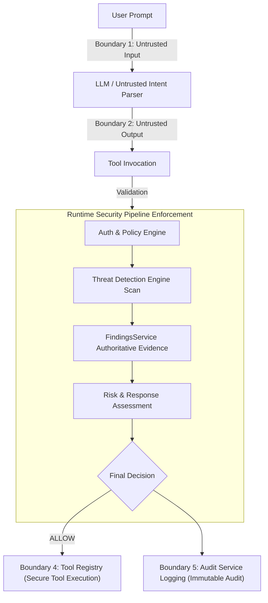

# Threat Model

## Objective

Identify threats against enterprise AI agents and define mitigations within the Enterprise Agent Security Platform.

The platform treats the AI model as an untrusted intent parser. All authorization, policy evaluation, and security decisions are performed by deterministic platform services.

---

## Security Scope

The security boundaries of the platform are defined as follows:

### In Scope
*   **Runtime Governance:** Intercepting and regulating all transactions initiated by enterprise agents.
*   **Authorization & Policies:** Verifying identity, roles, and resource arguments.
*   **Tool Execution Validation:** Restricting execution to verified and approved tool routines.
*   **Enterprise Resource Protection:** Safeguarding workspace files, directories, and external resources.
*   **Agent Interaction Auditing:** Capturing transaction lifecycles for compliance tracing.
*   **Authoritative Findings & Dynamic Risk Governance:** Persisting threat findings and computing isolated cumulative risk posture.

### Out of Scope
*   **Physical Infrastructure:** Underlying hardware security, database server administration, and local operating system configurations.
*   **Cloud Provider Compromise:** Security failures of cloud hosting environments or external network paths.
*   **Human Operational Processes:** Personnel security, manual approval workflow social engineering, and key custody.
*   **General Enterprise IT Controls:** Network routing tables, corporate firewalls, and employee workstation security.

---

## Threat Actors

The platform is designed to defend against the following threat actors:

*   **External Attacker:** Tries to execute prompt injection payloads to trick the agent into running unapproved actions or leaking sensitive files.
*   **Authenticated User:** Tries to leverage their user prompt interface to trigger agent actions exceeding their corporate privileges (e.g., elevation of privilege).
*   **Compromised AI Agent:** The agent runtime, influenced by adversarial instructions, attempts to execute tool chains or access resources outside its authorized footprint.
*   **Malicious Tool:** An unapproved or compromised tool script attempting to bypass execution limits or exfiltrate state variables.
*   **Compromised Provider:** The model adapter endpoint returning manipulated JSON structures or tool-call request arguments.
*   **Insider:** An internal developer or admin tampering with policy configurations or session log states.

---

## Attack Surfaces

The platform's vulnerability exposure is mapped across the following ingress and execution surfaces:

*   **User Prompt Interface:** Direct ingress point for natural language instructions (direct/indirect injection vectors).
*   **Provider Adapter:** Connection point translating AI model outcomes to domain objects.
*   **Tool Invocation:** The parsed request representing agent intent.
*   **Runtime Security Pipeline:** The core policy and threat checking validation pathway.
*   **Tool Registry:** The control plane mapping allowed tools to actual code instances.
*   **Tool Execution:** The zone where resolved capabilities perform filesystem or cloud operations.
*   **Enterprise Resources:** Files, directories, and internal databases targeted by agents.
*   **Audit Subsystem:** Append-only log pipeline recording compliance state.
*   **Management APIs & Security Console:** Control plane endpoints exposing agents, tools, sessions, rules, findings, and risk assessments.

---

## Trust Boundaries

The platform establishes explicit boundaries to contain untrusted inputs and enforce deterministic controls before tool execution:


```mermaid
flowchart TD
    User[User Prompt] -->|Boundary 1: Untrusted Input| LLM[LLM / Untrusted Intent Parser]
    LLM -->|Boundary 2: Untrusted Output| ToolInvoc[Tool Invocation]
    ToolInvoc -->|Validation| SecBoundary["Boundary 3: Runtime Security Pipeline"]
    
    subgraph SecBoundary [Runtime Security Pipeline Enforcement]
        AuthPolicy[Auth & Policy Engine] --> DetEngine[Threat Detection Engine Scan]
        DetEngine --> Findings[FindingsService Authoritative Evidence]
        Findings --> RiskResp[Risk & Response Assessment]
        RiskResp --> FinalDec{Final Decision}
    end

    FinalDec -->|ALLOW| AuthTool["Boundary 4: Tool Registry (Secure Tool Execution)"]
    FinalDec --> Audit["Boundary 5: Audit Service Logging (Immutable Audit)"]
```

### Boundary Descriptions

1. **User Prompt (Untrusted):** The entry point for natural language requests. User input is treated as untrusted and is scanned for malicious overrides (e.g. Prompt Injection).
2. **LLM Output (Untrusted):** The raw response returned by the foundation model. Treated as untrusted and parsed into a validated `ToolInvocation` object.
3. **Runtime Security Pipeline (Deterministic Boundary):** The core entry point where security enforcement happens. Every request must pass through this boundary before executing tools.
4. **Tool Registry & Secure Tool Execution Boundary (Secure Zone):** The trust boundary for resolving registered executable tools. Tool resolution and execution occur only after the Runtime Security Pipeline returns an `ALLOW` decision.
5. **Audit Boundary (Immutable):** The audit logging point. Event recording happens immediately after the final calculated decision, preserving the integrity of compliance logs.

---

## Security Invariants

The platform maintains the following immutable architectural guarantees:
1. **LLM output is never trusted:** ToolInvocation structures are treated as unverified payloads until verified by deterministic rules.
2. **Tool execution always passes through the Runtime Security Pipeline:** No tool can run without explicit authorization check validation.
3. **Authorization precedes execution:** No tool lookup is resolved prior to baseline policy check validation.
4. **Every final decision is audited:** All allow, deny, and approval-held execution outcomes write an append-only log record.
5. **Tool Registry is the only authority for registered executable tools:** The Agent Runtime resolves approved tool invocations through the Tool Registry.
6. **Security decisions remain deterministic:** Security results are calculated by code services, never by AI model prompts.
7. **Later security stages may only increase restrictions:** Pipeline checks can deny or hold requests, but they cannot override earlier denials.
8. **Findings represent authoritative evidence; derived posture is scoped by purpose:** `FindingsService` persists authoritative findings. `RiskService` derives a session-scoped `RiskAssessment` for reporting and attribution, and an agent-scoped `AgentRiskPosture` that enforcement decisions are made from ([ADR-024](../adr/ADR-024-agent-enforcement-state.md)).
9. **Runtime enforcement is one-way:** the runtime may contain an agent — suspending it and withdrawing its execution authority — but no runtime path returns one to service. Recovery requires an authorized, attributed administrative action.
10. **A session is security-owned by exactly one agent:** a request from any other agent is refused before any session state is read or written, so no agent can contribute evidence to another agent's enforcement posture.
11. **Execution identity and administrative identity are not implicitly interchangeable:** an `AGENT` principal executes only as itself, and no operator principal executes as an agent at all. Authority to manage an agent is not authority to act as one ([ADR-025](../adr/ADR-025-management-plane-authorization.md)).
12. **Every published route belongs to a plane with a declared role set:** authorization is applied at the router mount, evaluated before any resource lookup, and a route may narrow its plane but never widen it.

---

## Runtime Security Pipeline

The Runtime Security Pipeline coordinates the progressive validation of every Tool Invocation:

```text
Tool Invocation → Authorization → Policy Evaluation → Threat Detection → Findings → Risk Assessment → Response Recommendation → Final Decision → Audit → Secure Tool Execution
```

Each stage contributes additional security evidence to the context. Collectively, the Runtime Security Pipeline establishes the platform’s primary trust boundary between untrusted AI-generated requests and trusted enterprise capability execution. 

---

## Threat Scenarios (STRIDE Classification)

### Prompt Injection [Tampering / Elevation of Privilege]

#### Threat
An attacker attempts to manipulate the AI model's behavior and bypass application-level boundaries using malicious prompt instructions (e.g., jailbreaking or instruction overriding).

#### Mitigations
- **Prompt Injection Detection Rule:** Scans user prompts and model responses for deterministic prompt injection phrases (`PROMPT_INJECTION`).
- **Threat Detection Engine:** Statelessly runs the context through prompt injection rules to raise findings.
- **Risk & Response Engine:** Aggregates findings and recommends `REQUIRE_APPROVAL` (maps to final decision `APPROVAL_REQUIRED`), preventing the tool from executing until approved.
- **Audit Service:** Logs an immutable `AuditEvent` recording the blocked attempt and final `APPROVAL_REQUIRED` decision.

---

### Sensitive File Access [Information Disclosure]

#### Threat
An agent attempts to access protected system configurations, keys, or credentials on the filesystem.

#### Mitigations
- **Sensitive File Access Detection Rule:** Scans requested resources and user prompts for known sensitive file pattern strings (`SENSITIVE_FILE_ACCESS`).
- **Threat Detection Engine:** Detects these access patterns and raises security findings.
- **Runtime Security Pipeline:** Blocks file access by overriding the final execution decision based on the risk level.
- **Audit Service:** Logs the attempt, target file resource, and the blocked decision.

---

### Data Exfiltration [Information Disclosure / Tampering]

#### Threat
An agent attempts to read sensitive data and transmit it out of the enterprise boundary via an alternate channel or protocol.

#### Mitigations
- **Data Exfiltration Detection Rule:** Tracks the concurrent presence of exfiltration actions and sensitive data indicators (`DATA_EXFILTRATION`).
- **Threat Detection Engine:** Raises a high-severity finding if both exfiltration indicators are present.
- **Risk & Response Engine:** Maps findings to risk levels recommending `REQUIRE_APPROVAL` or agent suspension.
- **Runtime Security Pipeline:** Enforces the mapped action, blocking tool execution.

---

### Threat 7: Temporal Risk Masking & Cross-Agent Assessment Collision [Information Disclosure / Integrity]

#### Threat
1. **Temporal Risk Masking (H1):** Subsequent benign tool executions in an active session cause previous `HIGH`/`CRITICAL` findings to be ignored in dynamic risk scoring, masking the active session threat posture.
2. **Cross-Agent Assessment Collision (H2):** Reusing client-supplied `session_id` strings across different agents causes one agent's risk assessment to overwrite or pollute another's in memory.
3. **Ambiguous Unscoped Session Lookup (H2 API):** Requesting `GET /api/v1/risk-assessments/{session_id}` without `agent_id` when multiple agents used `session_id` returns whichever agent executed last, disclosing posture across agent boundaries.

#### Mitigations
- **Threshold Evidence Is Counted Once (M2a):** Session threshold detections such as `EXCESSIVE_DENIALS` carry a deterministic identity derived from the crossing (rule, session, agent, threshold). Re-deriving the same crossing on later requests records no new evidence, so unrelated traffic cannot inflate cumulative risk toward a false containment action.
- **Scenario Execution Isolation (M2a):** Scenario runs execute against a throwaway pipeline ([ADR-013 scenario isolation amendment](../adr/ADR-013-scenario-runner-service-boundaries.md)) with isolated agent, session, findings, risk, audit and execution-grant state, and emit no live behavioural telemetry. A security test cannot raise a live agent's posture or change its status, and cannot pollute live security evidence.
- **Cumulative Session Risk Evaluation (H1):** `RuntimeService` queries all accumulated findings recorded in `FindingsService` before evaluating risk, so benign tool executions never reset an elevated posture. Since [ADR-024](../adr/ADR-024-agent-enforcement-state.md) the posture that *enforcement* is derived from is scoped to the agent rather than the session, so presenting a new `session_id` cannot present an accumulated agent as new (finding H-3). The session-scoped assessment is retained for reporting and attribution.
- **Composite Key Isolation (H2):** `RiskService` indexes process-local assessments using composite key tuples `(session_id, agent_id)`.
- **Ambiguity Protection API (H2 API):** `RiskService.get_assessment()` and `GET /api/v1/risk-assessments/{session_id}` raise `AmbiguousAssessmentScopeError` and return `HTTP 400 Bad Request` if `agent_id` is omitted when multiple assessments match `session_id`. Zero cross-agent posture disclosure.

### Threat 8: Unauthenticated HTTP Gateway Access & Caller Identity Forgery [Spoofing / Elevation of Privilege]

#### Threat
An untrusted client on the network sends HTTP requests directly to FastAPI endpoints (`/agents/{agent_id}/execute`, `/api/scenarios/*`, or `/api/v1/*`) without authentication credentials, or supplies an arbitrary `agent_id` in the URL path to impersonate an enterprise agent or administrative principal. Unauthenticated access risks unauthorized tool execution, management plane telemetry disclosure, and audit log attribution falsification.

#### Mitigations
- **FastAPI HTTPBearer Gateway Enforcement:** All runtime, scenario, and management routers enforce JWT Bearer authentication (`get_current_principal` dependency). Requests lacking valid, signed, unexpired Bearer tokens are rejected immediately at the HTTP boundary with `HTTP 401 Unauthorized` and `WWW-Authenticate: Bearer` before reaching application services. Authentication is evaluated before authorization, so a request without a valid principal is refused as unauthenticated even where no role would have qualified.
- **Plane Authorization ([ADR-025](../adr/ADR-025-management-plane-authorization.md)):** Each router is mounted behind the role set its plane admits — runtime `AGENT`; scenarios and management `ANALYST`, `ADMIN` — and a route may narrow its plane but never widen it, because router-level and route-level dependencies are composed as an intersection. Reinstatement narrows to `ADMIN`. The management plane is operator-facing: an `AGENT` principal is refused, including for its own governance evidence. Until M3 this was finding H-2: `require_roles()` existed and no router applied it.
- **Runtime Execution Identity Binding:** `POST /agents/{agent_id}/execute` requires the principal to be an `AGENT` whose `claims.agent_id` equals the path `agent_id`. Expressed as a single positive rule rather than a set of denials, so no role reaches `RuntimeService` by falling through a gap between special cases. No operator principal may execute as an agent: under [ADR-024](../adr/ADR-024-agent-enforcement-state.md) activity attributed to an agent accumulates into that agent's posture and can contain it, so impersonation would be the ability to generate behavioural evidence against a subject the principal does not own. `ANALYST` principals are restricted to observability, findings triage, and attack scenario evaluation, which runs in an isolated sandbox.
- **Identity Claim Interpretation:** `JWTClaims.agent_id` is authoritative as an execution identity only for `AGENT` principals and is never the resource scope of an `ANALYST` or `ADMIN` principal. Placeholder values carried by operator tokens are not authorization subjects.
- **Fail-Closed Verification:** Token verification handles signature invalidity, expiration, and malformed claims structures deterministically without leaking stack traces or credentials.
- **Fail-Closed Signing Key Configuration:** `get_jwt_secret_key()` refuses to return a key unless `JWT_SECRET_KEY` is explicitly provisioned. There is no development fallback, the retired default shipped up to `74e8c51` is rejected explicitly, and keys shorter than the 32-byte HS256 minimum (RFC 7518 section 3.2) are refused. Because the key is resolved at import time, an unconfigured deployment cannot start rather than starting with a forgeable identity boundary.

### Threat 9: Authorization/Execution Divergence [Elevation of Privilege / Tampering]

#### Threat
A caller obtains an `ALLOW` decision for one operation and executes a different one — for example authorizing `file_read` on `notes.txt`, then executing it on `secrets.txt` — or replays a single authorization to execute the same operation repeatedly, including after cumulative risk has escalated. Reproduced at `74e8c51` as finding H-5: the decision was not bound to the executed parameters, so containment depended on caller discipline.

#### Mitigations
- **Canonical Execution Binding ([ADR-023](../adr/ADR-023-execution-authorization-grants.md)):** Every decision is bound to an immutable `ExecutionBinding` of tool, resource and canonically ordered parameters. A request whose explicit resource contradicts its `path` parameter is denied.
- **Signed, Single-Use, Short-Lived Grants:** Only a final `ALLOW` produces an `ExecutionGrant`, signed with HMAC-SHA256 by a per-process `ExecutionAuthority`, valid for one use within a short time-to-live.
- **Executor-Side Enforcement:** `DefaultToolExecutor` verifies authority, signature, expiry and single use, and requires an exact tool, resource and parameter match before instantiating or running the tool. Every failure raises `ExecutionBindingError` and executes nothing.
- **Resource-Aware HTTP Requests (finding M-2):** `ExecuteRequest` carries `resource` and `parameters`, so resource-aware policy evaluates the operation actually requested. The endpoint remains decision-only.

#### Residual Risk
- Code already executing inside the platform process can obtain a `BaseTool` from `ToolRegistry.get()` and call `execute()` directly. ADR-023 closes the confused-deputy path between components; it is not a defence against malicious in-process code.

### Threat 10: Enforcement Evasion, Concurrency, and Availability [Elevation of Privilege / Tampering / Denial of Service]

#### Threat

An agent evades or subverts containment in several ways: rotating `session_id` so accumulated risk is evaluated as new (finding H-3); relying on containment being advisory, since `SUSPEND_AGENT` downgraded one decision and was then discarded (finding H-4); writing into a session another agent owns, so the evidence gathered there is attributed to the victim and drives the victim toward suspension (finding NEW-002, a confused-deputy path into the containment mechanism); concurrent enforcement races where multiple workers attempt conflicting posture mutations; exploiting stale permissive postures during concurrent execution; inducing containment of a legitimate agent through inflated evidence; or taking advantage of storage/repository unavailability to achieve fail-open tool execution.

#### Mitigations

- **Agent-Scoped Enforcement Posture (H-3):** enforcement is derived from `AgentRiskPosture`, accumulated across every session the agent has used. A fresh identifier inherits the agent's posture.
- **Containment as State (H-4):** a final `SUSPEND_AGENT` writes `AgentStatus.SUSPENDED`, which `PolicyEngine` denies at the authorization stage of every later request, and withdraws execution authority.
- **Execution Authority Withdrawal:** suspension closes a per-agent issuance gate and revokes outstanding grants atomically, so a request that passed authorization moments earlier cannot still obtain authority. Revoked grants are refused as `REVOKED`.
- **Session Ownership (M-5, NEW-002):** `SessionService.bind_or_validate()` establishes ownership on first use under one lock and refuses any other agent. `RuntimeService` settles ownership before reading or writing session state, so a refused request records no session event, produces no finding, changes no posture, triggers no enforcement and issues no grant.
- **Attributed Evidence (defence in depth):** threshold detections group by session *and* agent, so ownership is never inferred from which denial happened to be recorded first.
- **False Containment Resistance:** threshold evidence is counted once per crossing, so unrelated traffic cannot inflate an agent toward suspension; scenario execution is isolated ([ADR-013](../adr/ADR-013-scenario-runner-service-boundaries.md) amendment) so a security test cannot contain a live agent.
- **Attributed Recovery:** reinstatement is ADMIN-only, requires a reason, records the acting principal, and establishes an enforcement baseline watermark so historical evidence does not immediately re-contain the agent.
- **Monotonic Concurrency & Atomic CAS (Plane 1 & Plane 3):** `AgentEnforcementState.epoch` is persisted directly on the state entity, never derived from audit history. Posture transitions require `expected_epoch == current_epoch` and advance `epoch` by exactly $+1$. State mutation and transition ledger append occur in a single atomic transaction. Stale concurrent writers fail closed with `EnforcementConcurrencyError`.
- **Database Serialization vs Authorization Policy Boundary:** The database guarantees transactional integrity and serialization: two conflicting mutations cannot both commit against the same expected epoch. The database does *not* decide whether suspension is warranted. The architecture strictly maintains: `Detection -> Risk -> Response -> EnforcementTransition -> Durable CAS`. The SQL layer provides integrity and atomic serialization of transitions; deterministic pipeline code remains the sole security decision authority.
- **Parent-Row Serialization Anchors:** When child or counter rows may not yet exist (pristine `agent_enforcement_state` or `agent_sequence_counters`), transactions serialize creation through an authoritative parent row (`agents` locked `FOR UPDATE`) to eliminate insertion race conditions across concurrent sessions.
- **Fail-Closed Posture Authority:** Any storage or repository failure raises `EnforcementStateUnavailableError`. `AuthorizationService.evaluate()` intercepts this, immediately short-circuits to `Decision.DENY` with reason `"Security posture authority unavailable (fail-closed)"`, sets `agent_check.status = FAILED`, marks downstream checks as `NOT_EVALUATED`, and issues no `RuntimeExecutionGrant`.
- **Administrative Lifecycle Superiority:** Administrative `AgentStatus.DISABLED` strictly dominates dynamic posture. Dynamic enforcement cannot mutate or create dynamic state for an administratively disabled agent.
- **Durable Authorization / Enforcement Interlock:** Grant issuance verifies `expected_epoch` under `agent_enforcement_state` row lock (`FOR UPDATE`), ensuring that containment transitions atomically serialize against issuance and preventing stale authorization context from obtaining an execution grant.
- **Exactly-Once Resumption Claims:** Resumption grants in `ApprovalGrantRepository` are claimed via atomic CAS from `APPROVED` to `CONSUMED` under row lock (`FOR UPDATE`), preventing concurrent duplicate tool execution across horizontal workers.
- **PostgreSQL Multi-Worker Concurrency Authority:** Production multi-worker MVCC semantics and race-condition resistance are verified against live PostgreSQL 16 across 7 explicit race tests.

#### Residual Risk

- **Session identifier squatting.** While callers choose identifiers, an agent may claim one another agent intended to use, denying the victim that identifier. It yields no access to an established session, its evidence, or another agent's posture. Server-issued unpredictable identifiers close it.
- **In-flight execution.** Revocation cannot stop a request that has already passed grant verification and entered tool execution.
- **Decision and audit consistency.** Under concurrency a request may be audited `ALLOW` and then obtain no grant because the gate closed in between. Execution stays closed; the audit record is the inconsistency.
- **Distributed Authorization-Read Consistency:** Plane 3 establishes PostgreSQL MVCC row locks, atomic CAS progression, and durable authorization-enforcement interlocks to prevent stale concurrent writers and unavailable-posture fail-open behavior across horizontal workers.

---

## Threat -> Mitigation Mapping

| Threat | STRIDE Category | Detection | Enforcement | Audit |
|:---|:---|:---|:---|:---|
| **Prompt Injection** | Tampering / EoP | Prompt Injection Rule | Runtime Security Pipeline | Audit Service |
| **Sensitive File Access** | Info Disclosure | Sensitive File Access Rule | Runtime Security Pipeline | Audit Service |
| **Data Exfiltration** | Info Disclosure / Tampering | Data Exfiltration Rule | Runtime Security Pipeline | Audit Service |
| **Unauthorized Tool Access** | EoP / Tampering | Authorization Service + Policy Engine | Runtime Security Pipeline (Fails closed and returns `DENY`) | Audit Service |
| **Runtime Decision Bypass** | EoP | Validation & Type checks | Runtime Security Pipeline (Authoritative decision point) | Audit Service |
| **Audit Log Tampering** | Repudiation / Tampering | N/A | Stateful Session Tracking vs. Immutable Auditing | Audit Service |
| **Temporal Risk Masking & Cross-Agent Collision** | Info Disclosure / Integrity | Cumulative `FindingsService` retrieval + `(session_id, agent_id)` composite keying | `RiskService` composite key isolation + HTTP 400 Bad Request ambiguity protection | Audit Service |
| **Agent Identity Spoofing** | Elevation of Privilege / Spoofing | Agent Identity Context Validation | `AgentRuntimeService` identity matching + `AgentService` authoritative registry lookup (`Decision.DENY` if unregistered/unauthorized) | Audit Service |
| **Unauthenticated HTTP Gateway Access & Caller Identity Forgery** | Spoofing / EoP | FastAPI `HTTPBearer` Gateway Dependency (`get_current_principal`) | HTTP 401 Unauthorized for missing/invalid token; mount-level `require_roles` per plane and `require_execution_identity` on the runtime route return HTTP 403 Forbidden before any resource lookup (ADR-025) | Audit Service |
| **Authorization/Execution Divergence** | EoP / Tampering | Canonical `ExecutionBinding` + contradictory-binding denial | `DefaultToolExecutor` requires a valid, single-use `ExecutionGrant` exactly matching the executed operation (ADR-023) | Audit Service |
| **Enforcement Evasion & Poisoning** | EoP / Tampering / DoS | Agent-scoped `AgentRiskPosture`; session ownership; per-agent threshold attribution | `AgentStatus.SUSPENDED` denied by `PolicyEngine`; issuance gate closed and outstanding grants revoked; non-owner requests refused before any session state changes (ADR-024) | Audit Service + enforcement transition history |
| **Detection Horizon Evasion Across Sessions** | EoP / Tampering | Agent-scoped detection horizon + dual monotonic sequencing (`agent_sequence`) | `SessionEventHorizonRepository` aggregates behavioral evidence across sessions per agent; caller-chosen session IDs cannot reset behavioral accumulation rules like `EXCESSIVE_DENIALS` (ADR-030) | Audit Service + detection findings |
| **Session-Sequence Allocation Race** | Tampering / Integrity | Repository-owned sequence assignment | `SqlSessionRepository` row lock on `sessions` serializes concurrent writes, guaranteeing gapless monotonic `1..N` allocation (ADR-030) | Audit Service + session event sequence |
| **Cross-Session Sequence Collision** | Tampering / Integrity | Agent-scoped monotonic sequence | `SqlSessionRepository` locks parent `agents` row `FOR UPDATE`, serializing `agent_sequence_counters` allocation across concurrent sessions (ADR-030) | Audit Service + agent sequence |
| **Pristine Enforcement-State Race** | EoP / Tampering | Dynamic posture initialization | `SqlEnforcementStateRepository` locks parent `agents` row `FOR UPDATE`, serializing initial epoch `0 -> 1` transition across concurrent workers (ADR-030) | Audit Service + enforcement ledger |
| **Stale Authorization Epoch / TOCTOU Grant Issuance** | EoP | CAS epoch validation at execution grant issuance | `ExecutionAuthority.issue(...)` validates `expected_epoch` under `agent_enforcement_state` row lock; concurrent suspensions or reinstatements reject grant issuance and fail closed to `Decision.DENY` (ADR-023, ADR-030) | Audit Service |
| **Double Grant Consumption (Replay)** | EoP / Tampering | Exactly-once execution claim | `SqlApprovalGrantRepository.transition_grant` uses atomic CAS (`APPROVED -> CONSUMED`) under row lock (`FOR UPDATE`); exactly one of N concurrent workers succeeds (ADR-031) | Audit Service + grant consumption timestamp |
| **Grant Reuse After Containment** | EoP | Execution authority withdrawal | `ExecutionAuthority.suspend_issuance` closes issuance gate and revokes outstanding grants atomically; executor rejects stale grants as `REVOKED` (ADR-023, ADR-031) | Audit Service + refusal evidence |
| **Split State / Transition Persistence** | Tampering / Integrity | Atomic single-transaction commit | `SqlEnforcementStateRepository` commits state row update and transition ledger append together; partial or inconsistent state cannot commit (ADR-030) | Audit Service + transition ledger |
| **Detection Horizon Storage Failure** | Availability / EoP | Fail-closed domain exception normalization (`HorizonUnavailableError`) | Repository failures normalize to `SessionRepositoryError`; Runtime halts execution (`HORIZON_UNAVAILABLE`) with no grant issued (ADR-030) | Audit Service + telemetry |

---

## Security Standards Mapping

The platform maps threat detections to industry security frameworks through rule metadata:
- **OWASP LLM Top 10:** Mapped via control ID (e.g., `LLM01` for Prompt Injection).
- **MITRE ATLAS:** Maps threat techniques to adversarial AI matrices (e.g., `AML.T0043` for User Prompt Injection).
- **MITRE ATT&CK:** Mapped to standard attacker techniques (e.g., `T1083` for File Discovery, `T1048` for Exfiltration Over Alternative Protocol).

---

## Residual Risks

- **Heuristic Detection Limits:** Detections rely on deterministic rules; complex semantic evasion requires future vector-based classification.
- **Durable State Persistence (Plane 3):** Resolved. Relational persistence models and SQL repository adapters ([ADR-030](../adr/ADR-030-durable-state-repository-architecture.md)) provide durable storage across restarts for session lifecycle, detection horizon events, monotonic enforcement epochs, and execution resumption grants.
- **Session Registration Boundary:** resolved. Sessions are established and owned on first use, and a request from a non-owner is refused before any session state changes ([ADR-024](../adr/ADR-024-agent-enforcement-state.md)).
- **Containment Durability:** Resolved for SQL-backed deployments via `SqlEnforcementStateRepository` (ADR-030), guaranteeing that suspensions, monotonic epochs, and enforcement transitions persist across process restarts.
- **Caller-Chosen Session Identifiers:** sessions are owned from first use, but identifiers are still supplied by callers, so squatting remains possible as an availability concern. Server-issued session identifiers are the target model.
- **Execution Identity at the Executor:** a grant is bearer-like within the process: `DefaultToolExecutor` verifies the grant, not the identity of the caller presenting it. Binding execution to a trusted caller identity is a separate design question.
- **Undifferentiated Operator Roles:** `ANALYST` and `ADMIN` see the same management evidence. Resource-scoped authorization has no subject while no role holds partial visibility, so it is deferred rather than implemented; the convention it must follow — `404` rather than `403` where a principal is permitted a resource class but not an instance — is recorded in [ADR-025](../adr/ADR-025-management-plane-authorization.md).
- **No Tenancy:** roles are global to the process. There is no notion of an operator scoped to a subset of agents.
- **Administrative Evaluation of a Live Agent:** administrators can no longer execute as an agent, and the scenario sandbox cannot reproduce a live agent's accumulated posture. Attributed delegation, if required, is a separate design question ([ADR-021](../adr/ADR-021-multi-agent-governance.md)).
- **Scenario Resource Consumption:** scenario execution is permitted to operators. Prompt-mode scenarios call a model provider, so repeated execution is a cost and load concern addressed by quota rather than by authorization.
- **External Identity Provider Integration:** Current gateway authentication uses symmetric JWT verification (`HS256`). Asymmetric signing (`RS256`/`ES256`) and dynamic enterprise IdP / OIDC discovery are planned for distributed deployment milestones.

---

## Adversarial Regression Corpus

The adversarial corpus in `tests/security/` captures vulnerabilities identified during the post-v0.16 review and will be used as the regression baseline for subsequent security-hardening milestones.

Each finding is represented twice: a `security_baseline` test recording the behaviour observed at commit `74e8c51`, and a `security_invariant` test stating the contract a hardening milestone must establish. Invariant tests are marked `xfail(strict=True)`, so they convert into permanent assertions at the moment a fix makes them pass. See `tests/security/README.md` for the finding index and execution instructions.

---

## DevSecOps & CI/CD Security Controls

- **Automated Quality Pipeline:** PR validation executes parallel quality gates for Pytest, Ruff, ESLint, Vite build, Markdownlint, and Git whitespace checking.
- **Secret Scanning:** `gitleaks` scans commit history and PR diffs to prevent credential/key exposure.
- **Least Privilege Workflows:** Workflows run under unprivileged `pull_request` triggers with `permissions: contents: read` and zero production secrets.
